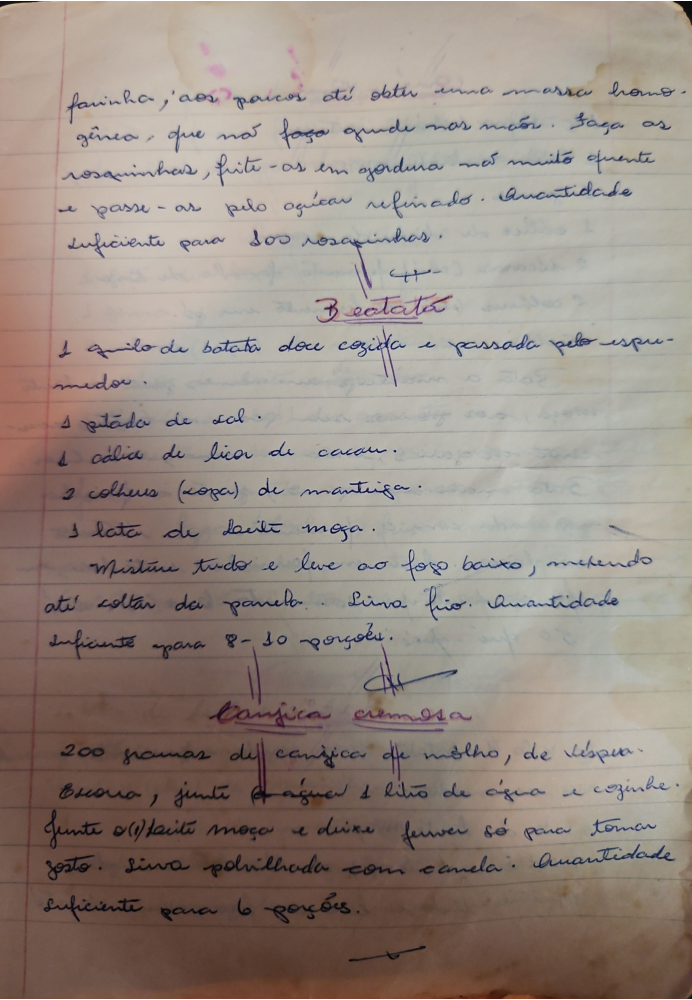

# Página 10
:::danger[NÃO REVISADO]
A página não foi revisada, portanto pode conter erros de digitação, formatação ou alucinações.
:::
## Rosquinhas

farinha, aos poucos até obter uma massa homogênea, que não faça grude nas mãos. Faça as rosquinhas, frite-as em gordura não muito quente e passe-as pelo açúcar refinado. Quantidade suficiente para 100 rosquinhas.

## Batata

*   1 quilo de batata doce cozida e passada pelo espremedor.
*   1 pitada de sal.
*   1 colher de licor de cacau.
*   2 colheres (sopa) de manteiga.
*   1 lata de leite moça.

Misture tudo e leve ao fogo baixo, mexendo até soltar da panela. Sirva frio.
Quantidade suficiente para 8-10 porções.

## Canjica cremosa

*   200 gramas de canjica de milho, de véspera.

Enxague, junte 1 litrão de água e cozinhe.
Junte lata O leite moça e deixe ferver só para tomar gosto. Sirva polvilhada com canela.
Quantidade suficiente para 6 porções.

