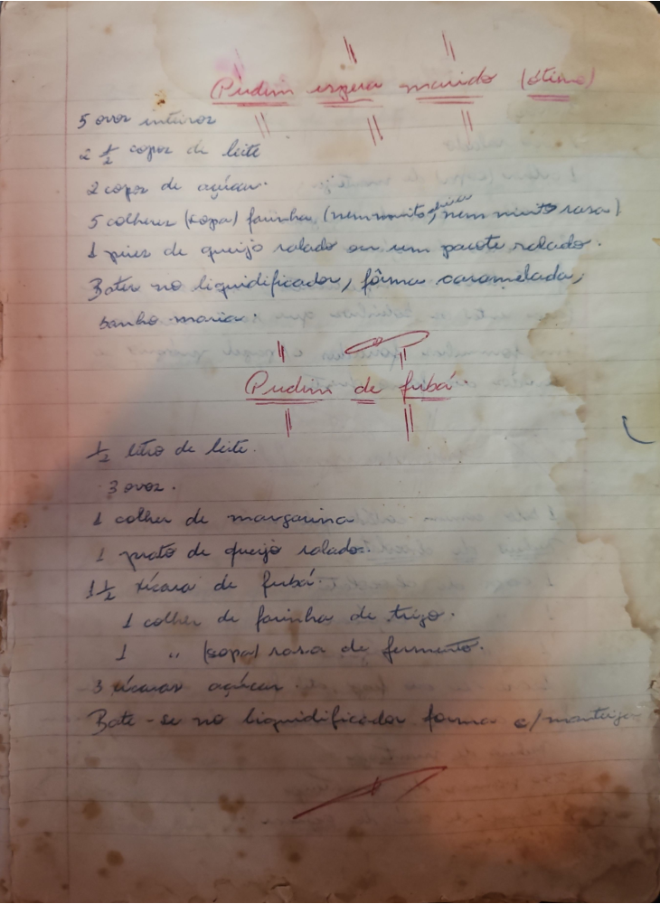

# Página 2
:::danger[NÃO REVISADO]
A página não foi revisada, portanto pode conter erros de digitação, formatação ou alucinações.
:::
## Pudim ergue macio (ou firme)

*   5 ovos inteiros
*   2 ½ copos de leite
*   2 copos de açucar
*   5 colheres (sopa) farinha (nem muito, nem muito rasas)
*   1 pires de queijo ralado ou um pacote ralado
*   Bater no liquidificador, forma caramelada
*   banho maria

## Pudim de fubá

*   ½ litro de leite
*   3 ovos
*   1 colher de margarina
*   1 prato de queijo ralado
*   1 ½ xícara de fubá
*   1 colher de farinha de trigo
*   1 colher (sopa) rasa de fermento
*   3 xícaras açucar
*   Bate-se no liquidificador forma c/ manteiga

