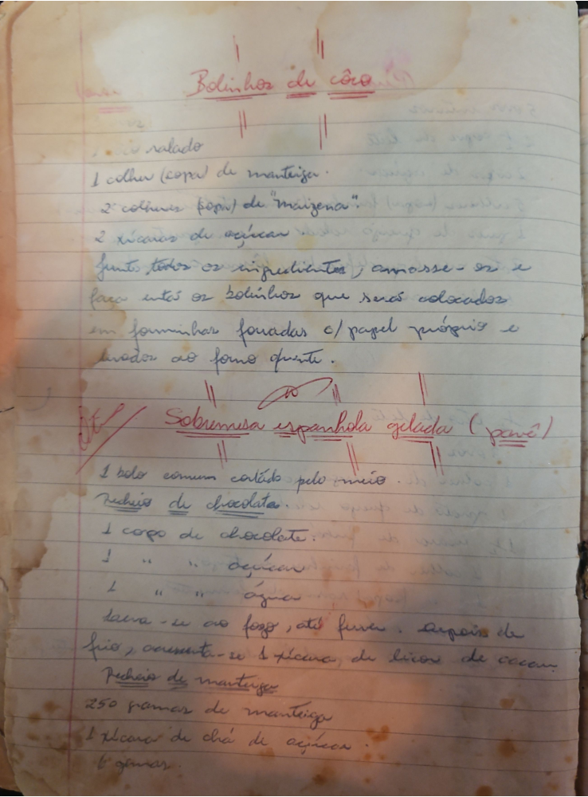

# Página 3
:::danger[NÃO REVISADO]
A página não foi revisada, portanto pode conter erros de digitação, formatação ou alucinações.
:::
## Bolinhos de côco

- ralado
- 1 colher (sopa) de manteiga
- 2 colheres (sopa) de "maizena"
- 2 xícaras de açúcar
- Juntar todos os ingredientes, amassar - se e fazer então os bolinhos que serão colocados em forminhas forradas c/ papel própris e levar ao forno quente.

## Sobremesa espanhola gelada (pané)

- 1 bolo commum cortado pelo meio

### Recheio de chocolate:

- 1 copo de chocolate.
- 1 " " " açúcar
- 1 " " " água
- leva-se ao fogo, até furar. Depois de frio, accrescenta-se 1 xicara, de licor de cacau.

### Recheio de manteiga:

- 250 gramas de manteiga
- 1 xicara de chá de açúcar
- 6 gemas.

