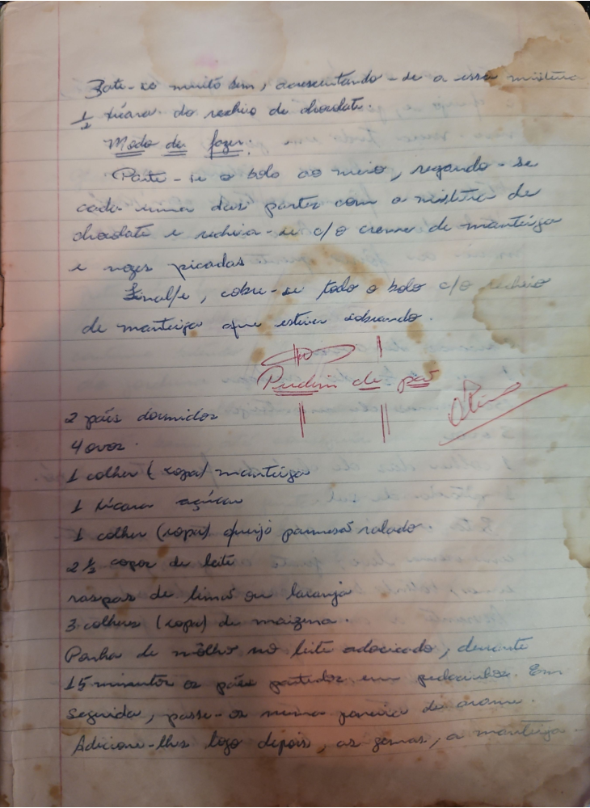

# Página 4
:::danger[NÃO REVISADO]
A página não foi revisada, portanto pode conter erros de digitação, formatação ou alucinações.
:::
Bate-se muito bem, acrescentando-se a essa mistura
1 xicara do recheio de chocolate.

### Modo de fazer:

Parte-se o bolo ao meio, regando-se
cada uma das partes com a mistura de
chocolate e recheia-se com o creme de manteiga
e nozes picadas.
Finalmente, cobre-se todo o bolo com o recheio
de manteiga que estiver sobrando.

## Pudim de Pão

- 2 paes dormidos
- 4 ovos.
- 1 colher (sopa) manteiga.
- 1 xicara açucar.
- 1 colher (sopa) queijo parmesao ralado.
- 2 ½ copos de leite.
- raspa de limao ou laranja.
- 3 colheres (sopa) de maizena.

Ponha de molho no leite adoçicado, durante
15 minutos os paes partidos em pedacinhos. Em
seguida, passe-os numa peneira de arame.
Adicione-lhes logo depois, as gemas, a manteiga

