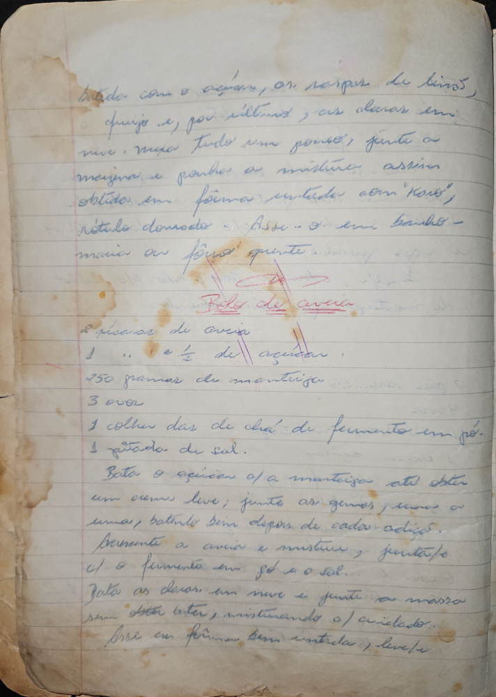

# Página 5
:::danger[NÃO REVISADO]
A página não foi revisada, portanto pode conter erros de digitação, formatação ou alucinações.
:::
batido com o açucar, ou raspar de limão,
queijo e, por ultimo, as claras em
neve. Muxa tudo um pouco, junte a
mazina, e ponha as misturas assim
obtidas em fôrmas untadas com "korte",
retangulo domado - Asse - 0 em banho -
maria ou fôrno quente.

## Bolo de aveia

*   2 xicaras de aveia
*   1 xicara e ½ de açucar.
*   250 gramas de manteiga.
*   3 ovos
*   1 colher das de chá de fermento em pó.
*   1 pitada de sal.

Bata o açucar e/ ou a manteiga até obter
um creme leve; junte as gemas, uma a
uma, batendo bem depois de cada adição.
Junte a aveia a mistura, junte-se
c/ o fermento em pó e o sal.
Bata as claras em neve e junte á massa
sem bater, misturando c/ cuidado.
Asse em fôrmas bem untadas, leve/

