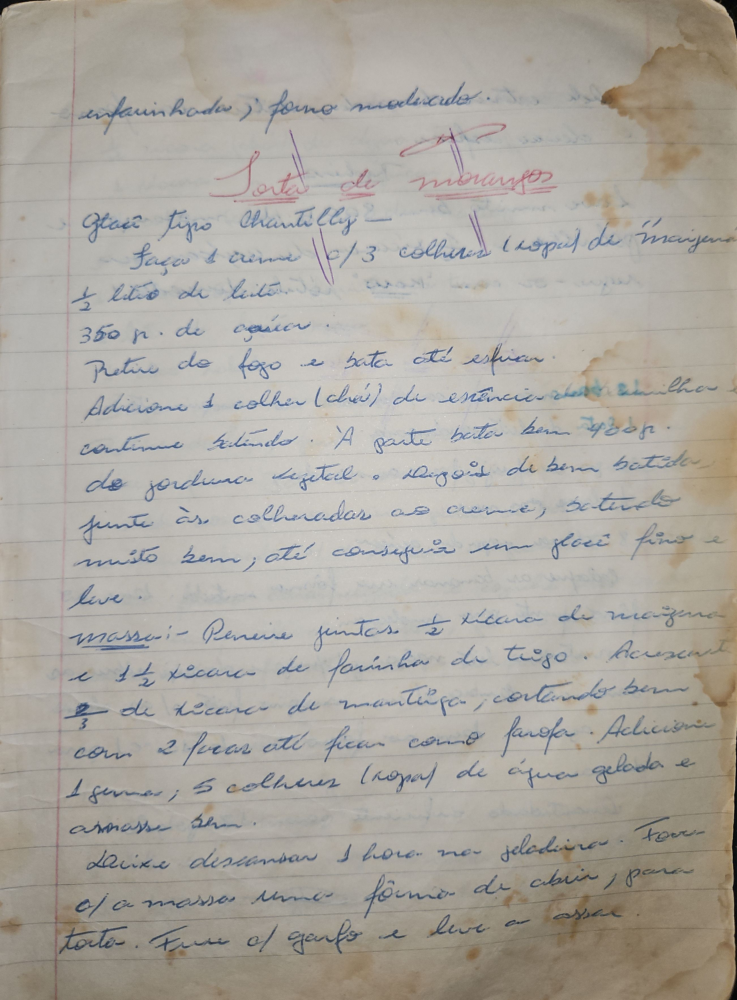

# Página 6
:::danger[NÃO REVISADO]
A página não foi revisada, portanto pode conter erros de digitação, formatação ou alucinações.
:::
enfarinhada; forno moderado.

## Torta de morangos

### Glace tipo Chantilly

*   Faça 1 creme c/ 3 colheres (sopa) de maisena
*   ½ litro de leite
*   350 gr. de açúcar.
*   Retire do fogo e bata até esfriar.
*   Adicione 1 colher (chá) de essencia de baunilha e continue batendo.
*   À parte bata bem 400gr. de gordura vegetal.
*   Depois de bem batida, junte às colheradas ao creme; batendo muito bem, até conseguir um glacê fino e leve.

### massa

*   Peneire juntas: ½ xícara de maisena
*   e 1 ½ xícara de farinha de trigo.
*   Acrescente 2/3 de xícara de manteiga, cortando bem
*   com 2 facas até ficar como farofa.
*   Adicionar 1 gema; 5 colheres (sopa) de água gelada e
*   amasse bem.
*   Deixe descansar 1 hora na geladeira.
*   Forre uma fôrma de abrir, para torta.
*   Fure c/ garfo e leve a assar.

