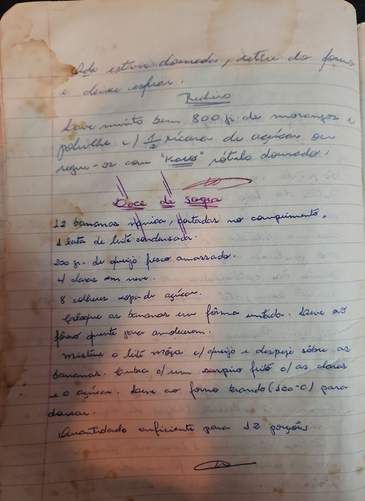

# Página 7
:::danger[NÃO REVISADO]
A página não foi revisada, portanto pode conter erros de digitação, formatação ou alucinações.
:::
## Rubins

tivessem dourados, retire do forno
e deixe esfriar.

Lave muito bem 800 gr. de morangos e
polvilhe c/ ½ xícara de açucar ou
regue-os com "Koro" rótulo dourado!

## Doce de sogra

*   12 bananas nanica, cortadas no comprimento.
*   1 lata de leite condensada.
*   200 gr. de queijo fresco amassado.
*   4 claras em neve.
*   8 colheres sopa de açucar.

Coloque as bananas em forma untada. Leve ao forno quente para amolecerem.
Misture o leite moça c/ queijo e despeje sobre as bananas.
Cubra c/ um suspiro feito c/ as claras e o açucar.
Leve ao forno brando (100°C) para dourar.

Quantidade suficiente para 12 porções.

