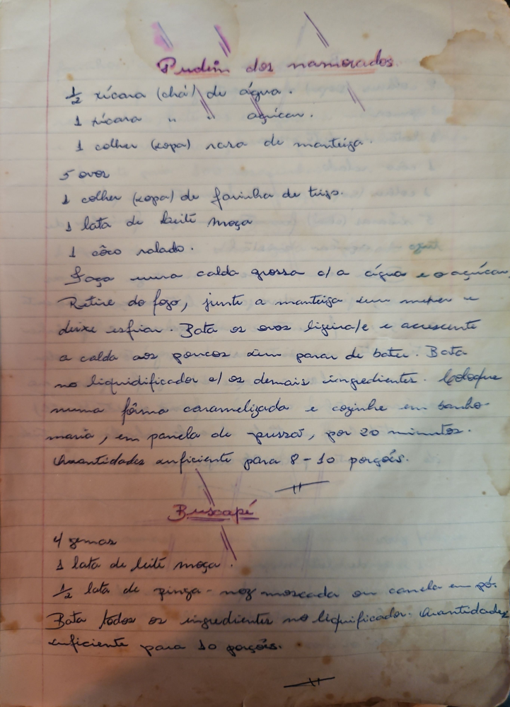

# Página 8
:::danger[NÃO REVISADO]
A página não foi revisada, portanto pode conter erros de digitação, formatação ou alucinações.
:::
## Pudim dos namorados

### Ingredientes

*   ½ xícara (chá) de água.
*   1 xícara " " açúcar.
*   1 colher (sopa) de manteiga.
*   5 ovos
*   1 colher (sopa) de farinha de trigo.
*   1 lata de leite moça.
*   1 côco ralado.

### Modo de Preparo

*   Faça uma calda grossa c/ a água e o açúcar.
*   Retire do fogo, junte a manteiga sem mexer e deixe esfriar.
*   Bata os ovos ligeiro e acrescente a calda aos poucos sem parar de bater.
*   Bata no liquidificador c/ os demais ingredientes.
*   Coloque numa fôrma caramelizada e cozinhe em banho-maria, em panela de pressão, por 20 minutos.
*   Quantidades suficientes para 8-10 porções.

Buscape

### Ingredientes

*   4 gemas
*   1 lata de leite moça.
*   ½ lata de pinga - noz moscada ou canela em pó.

### Modo de Preparo

*   Bata todos os ingredientes no liquidificador.
*   Quantidades suficientes para 10 porções.

