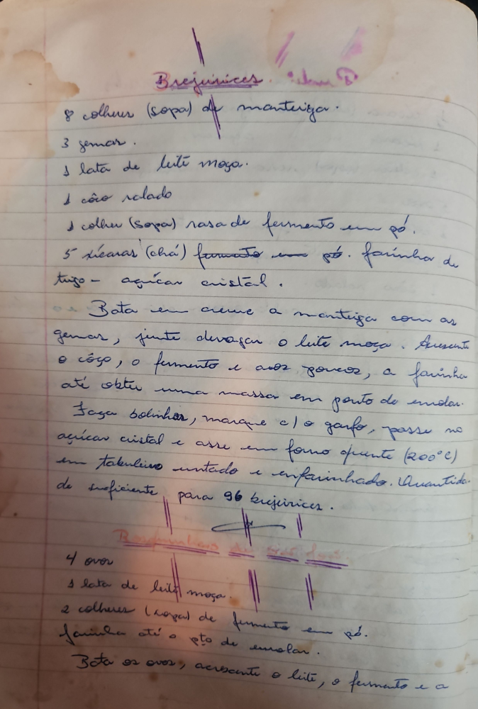

# Página 9
:::danger[NÃO REVISADO]
A página não foi revisada, portanto pode conter erros de digitação, formatação ou alucinações.
:::
## Beijinices

*   8 colheres (sopa) de manteiga.
*   3 gemas.
*   1 lata de leite moça.
*   1 côco ralado
*   1 colher (sopa) rasa de fermento em pó.
*   5 xícaras (chá) formadas com pó. farinha de trigo - açúcar cristal.

Bata em creme a manteiga com as gemas, junte devagar o leite moça. Acrescente o côco, o fermento e aos poucos, a farinha até obter uma massa em ponto de enrolar. Fazer bolinhas, marque c/ o garfo, passe no açúcar cristal e asse em forno quente (200°C) em tabuleiro untado e enfarinhado. Quantidade suficiente para 96 beijinices.

## Breijinices

*   4 ovos
*   1 lata de leite moça
*   2 colheres (chá) de fermento em pó.
*   farinha até o pto de enrolar.

Bata os ovos, acrescente o leite, o fermento e a

