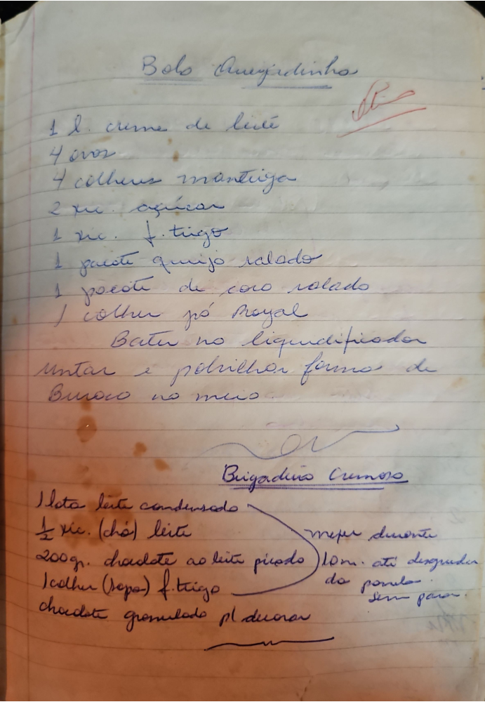

# Página 101
:::danger[NÃO REVISADO]
A página não foi revisada, portanto pode conter erros de digitação, formatação ou alucinações.
:::
## Bolo Amarelinho

- 1 L creme de leite
- 4 ovos
- 4 colheres manteiga
- 2 xc. açúcar
- 1 xc. f. trigo
- 1 pacote queijo ralado
- 1 pacote de coco ralado
- 1 colher pó Royal

Bater no liquidificador
Untar e polvilhar formas de Buraco no meio.

---

## Brigadeiro Cremoso

- 1 lata leite condensado
- ½ xc. (chá) leite
- 200 gr. chocolate ao leite picado
- 1 colher (sopa) f. trigo
- chocolate granulado pl decorar

mexer durante 10m. até desgrudar da panela sem parar.

