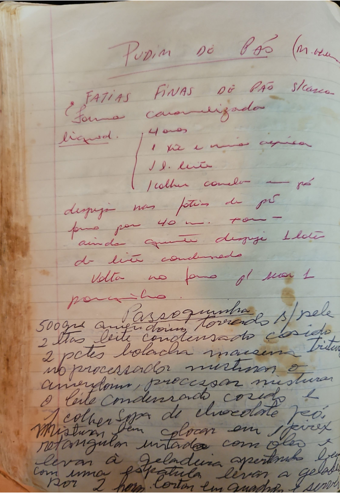

# Página 102
:::danger[NÃO REVISADO]
A página não foi revisada, portanto pode conter erros de digitação, formatação ou alucinações.
:::

## PUDIM DE PÃO (Mole)

*   fatias finas de pão s/ casca
*   forma caramelizada

### Liquido:

*   4 ovos
*   1 xicara e meia de açucar
*   1 l. leite
*   1 colher de canela em pó

### Modo de Preparo:

*   despejar nas fatias de pão
*   forno por 40 m. + ou -
*   ainda quente despeje 1 lata de leite condensado
*   volta no forno só para secar um pouquinho.

***

## Passoquinha

### Ingredientes:

*   500grs amendoim torrado s/ pele
*   2 latas leite condensado cozido
*   2 pctes bolacha maizena triturada
*   1 colher sopa de chocolate em pó

### Modo de Preparo:

*   no processador misturar o amendoim, processar misturar o leite condensado cozido e a bolacha maizena triturada
*   Misturar bem
*   colocar em 1 pirex retangular untado com oleo
*   levar à geladeira apertando bem com uma espatula
*   por 2 horas. Cortar em quadrados e servir

