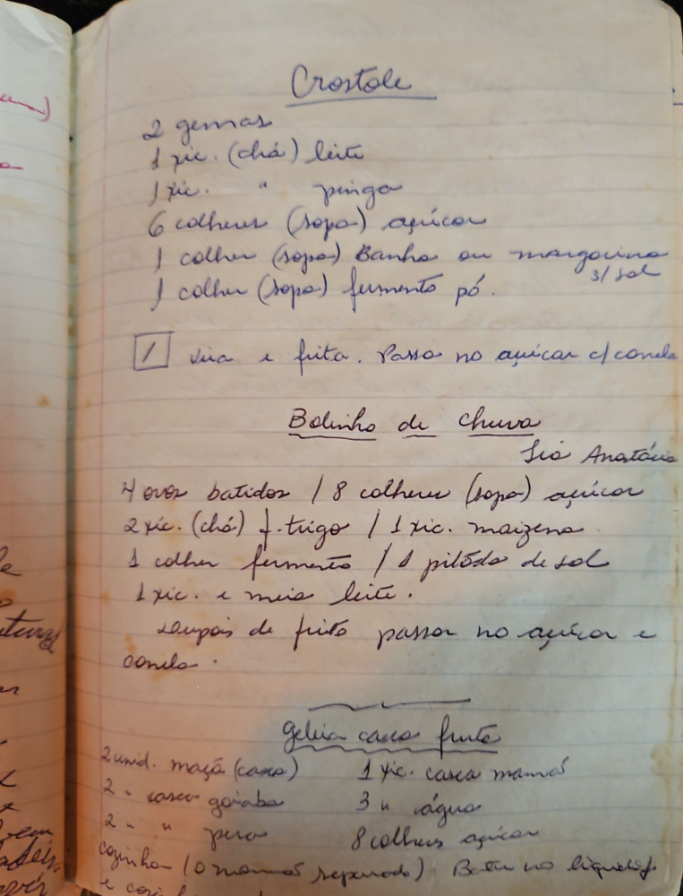

# Página 103
:::danger[NÃO REVISADO]
A página não foi revisada, portanto pode conter erros de digitação, formatação ou alucinações.
:::
## Crostole

*   2 gemas
*   1 xíc. (chá) leite
*   1 xíc. " pingo
*   6 colheres (sopa) açúcar
*   1 colher (sopa) Banha ou margarina 3/sol
*   1 colher (sopa) fermento pó.

*   Sova e frita. Passa no açúcar c/canela.

## Bolinho de Chuva
### Tia Anatácia

*   4 ovos batidos
*   8 colheres (sopa) açúcar
*   2 xíc. (chá) f. trigo
*   1 xíc. maizena.
*   1 colher fermento
*   1 pitada de sol
*   1 xic. e meia leite.

*   Depois de frito passar no açúcar e canela.

## Geleia casca fruta

*   2 unid. maçã (casca)
*   2 - casca goiaba
*   2 - " pera
*   1 xic. casca mamão
*   3 x água
*   cozinho (10 minutos separado)
*   8 colheres açúcar

*   Bater no liquid.
*   e cozinhar

