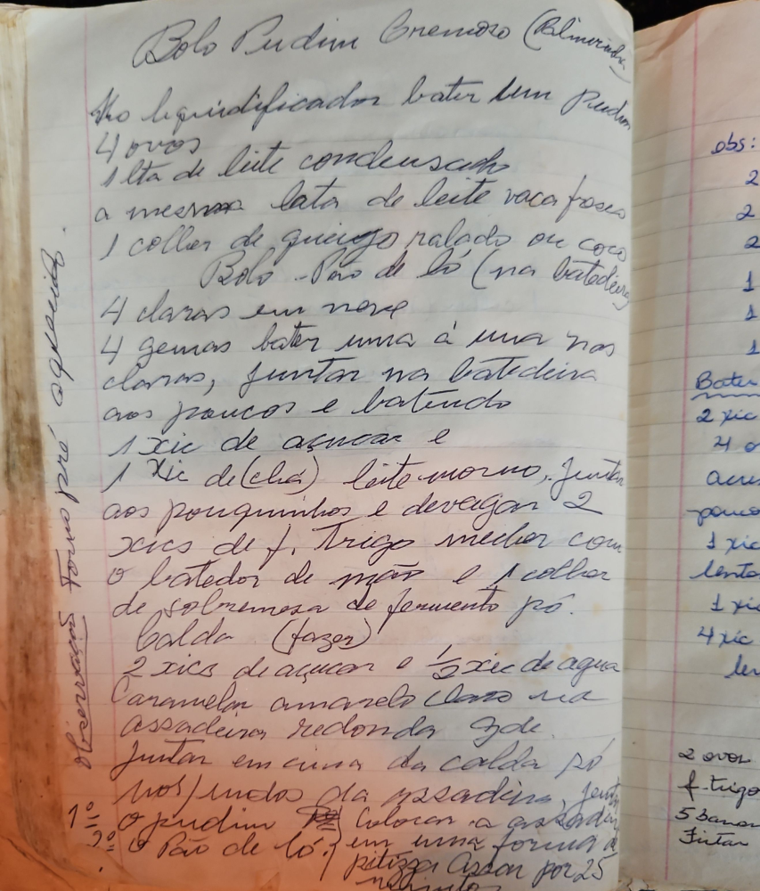

# Página 104
:::danger[NÃO REVISADO]
A página não foi revisada, portanto pode conter erros de digitação, formatação ou alucinações.
:::
## Bolo Pudim Cremoso (Almerinda)

### Pudim
No liquidificador bater bem
- 4 ovos
- 1 lata de leite condensado
- a mesma lata de leite vaca (fresco)
- 1 colher de queijo ralado ou coco

### Bolo - Pão de ló (na batedeira)
- 4 claras em neve
- 4 gemas bater uma a uma nas claras, juntar na batedeira aos poucos e batendo
- 1 xic de açucar e
- 1 xic de (chá) leite morno, juntar aos pouquinhos e devagar
- 2 xic de f. Trigo mexer com o batedor de mão e 1 colher de sobremesa de fermento pó.

### Calda (fazer)
- 2 xic de açucar e 1/2 xic de agua

Caramelar amarello claro na assadeira redonda gde. Juntar em cima da calda pro nos fundos da assadeira, juntar
1º o pudim
2º o Pão de ló

Colocar a assadeira em uma forma maior com agua (banho maria).
1/2 hora de forno, depois tirar a agua e deixar mais 1/2 hora.

### Forno pré

### Observações
- 2 ovos
- 2 xic de f. trigo
- 2 xic de açucar
- 2 cl. de fermento
- 1 xic de leite
- 1 cl. de manteiga

### Bater na batedeira
- 2 xic f. trigo
- 4 ovos
- açucar

- poucos cl. fermento
- 1 xic leite
- 1 xic manteiga
- lento

- 1 xic
- 4 xic
- leve

- 2 ovos
- f. trigo
- 5 bananas
- Juntar

