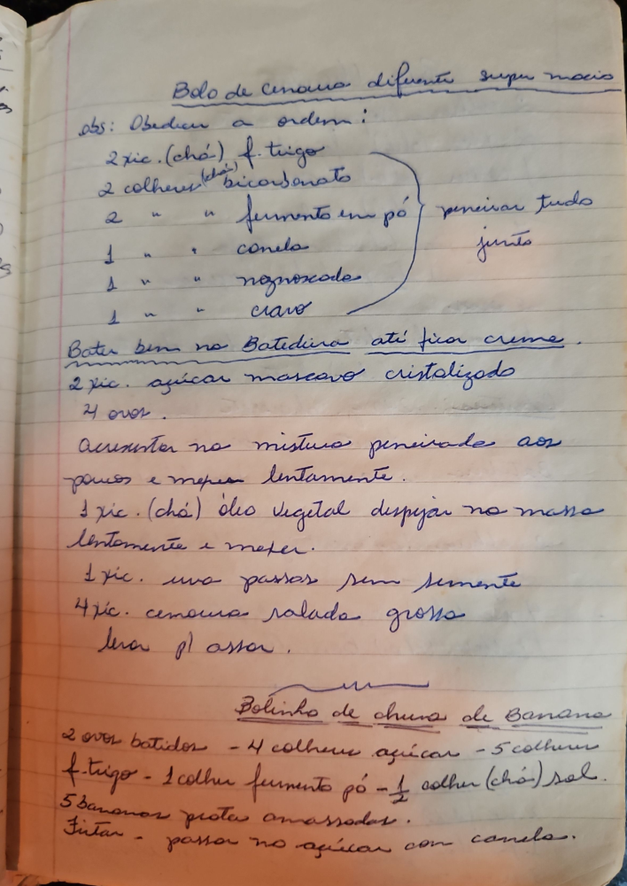

# Página 105
:::danger[NÃO REVISADO]
A página não foi revisada, portanto pode conter erros de digitação, formatação ou alucinações.
:::
## Bolo de cenoura diferente super macio

Obs: Obdecer a ordem!

*   2 xic. (chá) f. trigo
*   2 colheres (chá) bicarbonato
*   2 " " fermento em pó
*   1 " " canela
*   1 " " noz-moscada
*   1 " " cravo

(peneirar tudo junto)

*   Bater bem na Batedeira até ficar creme.
*   2 xic. açúcar mascavo cristalizado
*   4 ovos.
*   Acrescentar na mistura peneirada aos poucos e mexer lentamente.
*   1 xic. (chá) óleo vegetal despejar na massa lentamente e mexer.
*   1 xic. uva passas sem semente
*   4 xic. cenoura ralada grossa
*   Levar p/ assar.

## Bolinho de chuva de Banana

*   2 ovos batidos
*   4 colheres açúcar
*   5 colheres f. trigo
*   1 colher fermento pó
*   1/2 colher (chá) sal
*   5 bananas prata amassadas.
*   Fritar - passar no açúcar com canela.

