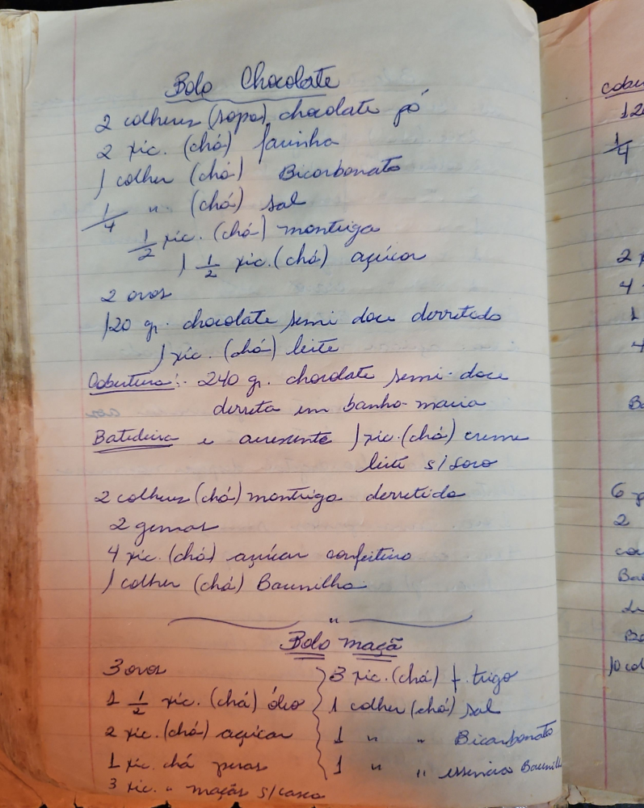

# Página 106
:::danger[NÃO REVISADO]
A página não foi revisada, portanto pode conter erros de digitação, formatação ou alucinações.
:::
## Bolo Chocolate

- 2 colheres (sopa) chocolate pó
- 2 xic. (chá) farinha
- 1 colher (chá) Bicarbonato
- ¼ xic. (chá) sal
- ½ xic. (chá) manteiga
- 1 ½ xic. (chá) açucar
- 2 ovos
- 120 gr. chocolate semi doce derretido
- 1 xic. (chá) leite

### Cobertura:

- 240 gr. chocolate semi doce
  derreta em banho maria
- Batideira e acrescente 1 xic. (chá) creme
  leite s/soro

- 2 colheres (chá) manteiga derretida
- 2 gemas
- 4 xic. (chá) açucar confeiteiro
- 1 colher (chá) Baunilha

## Bolo maçã

- 3 ovos
- 1 ½ xic. (chá) óleo
- 2 xic. (chá) açucar
- 1 xic. chá peras
- 3 xic. xic. maçãs s/casca

- 3 xic. (chá) f. trigo
- 1 colher (chá) sal
- 1 colher (chá) Bicarbonato
- 1 colher (chá) essencia Baunilha

