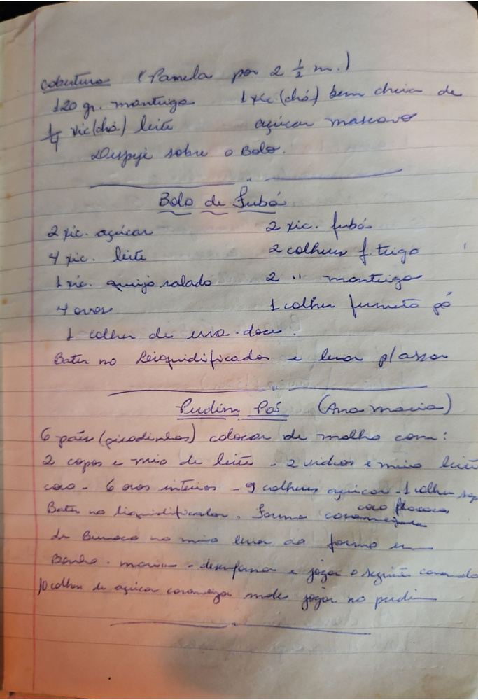

# Página 107
:::danger[NÃO REVISADO]
A página não foi revisada, portanto pode conter erros de digitação, formatação ou alucinações.
:::
## Cobertura
(Panela por 2 ½ m.)

- 120 gr. manteiga
- ½ vic (chá) leite
- 1 xc (chá) bem cheia de açucar mascavo
- Depeje sobre o Bolo.

---

## Bolo de fubá

- 2 xic. açucar
- 4 xic. leite
- 1 xic. queijo ralado
- 4 ovos
- 2 xic. fubá
- 2 colhers f trigo
- 2 '' manteiga
- 1 colher fermento pó
- 1 colher de erva-doce.

Bater no Leiquidificador e levar p/ assar.

---

## Pudim Pão (Ana maria)

- 6 pães (picadinhos) colocar de molho com:
- 2 copos e meio de leite
- 2 vidros e meio leite de coco
- 6 ovos inteiros
- 9 colhers açucar
- 1 colher sopa cacao em flocos.

Bater no liquidificador. Forma caramelizada de Buraco no meio levar ao forno em Banho-maria - desenformar e jogar o seguinte caramelo
- 10 colher de açucar caramelizar onde jogar no pudim.

