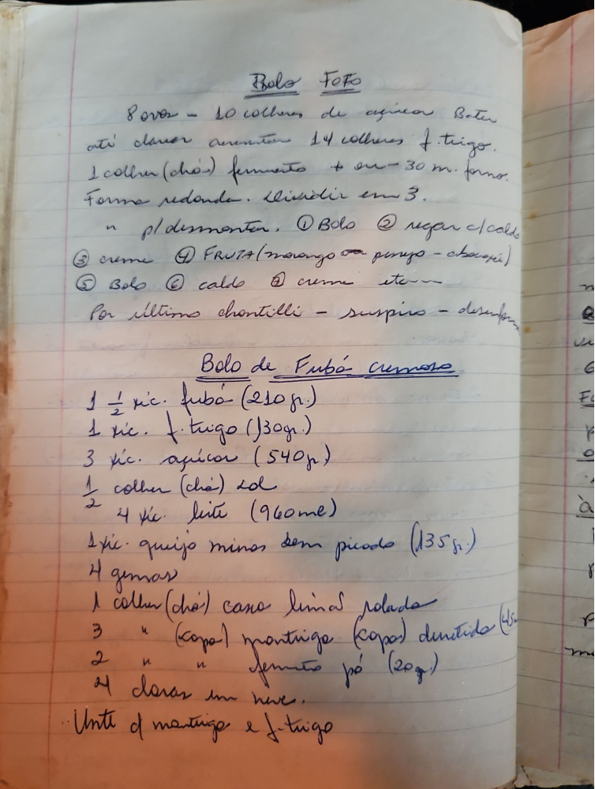

# Página 108
:::danger[NÃO REVISADO]
A página não foi revisada, portanto pode conter erros de digitação, formatação ou alucinações.
:::
## Bolo Fofo

-   8 ovos - 10 colheres de açúcar Bater até clarear
-   aumentar 14 colheres f. trigo.
-   1 colher (chá) fermento + ou - 30 m. forno.
-   Forma redonda. p/ desmontar.
-   dividir em 3.
-   ① Bolo
-   ② regar c/ calda
-   ③ creme
-   ④ FRUTA (morango ou pêssego - abacaxi)
-   ⑤ Bolo
-   ⑥ calda
-   ⑦ creme etc--
-   Por ultimo chantilli - suspiro - desenho

## Bolo de Fubá cremoso

-   1 ½ xíc. fubá (210 gr.)
-   1 xíc. f. trigo (130 gr.)
-   3 xíc. açúcar (540 gr)
-   ½ colher (chá) sal
-   4 xíc. leite (960 ml)
-   1 xíc. queijo minas sem picado (135 gr.)
-   4 gemas
-   1 colher (chá) casca limão ralada
-   3 colheres (sopa) mantriga derretida (45 gr.)
-   2 colheres (sopa) fermento pó (20 gr.)
-   4 claras em neve.
-   Unte a mantriga e f. trigo

