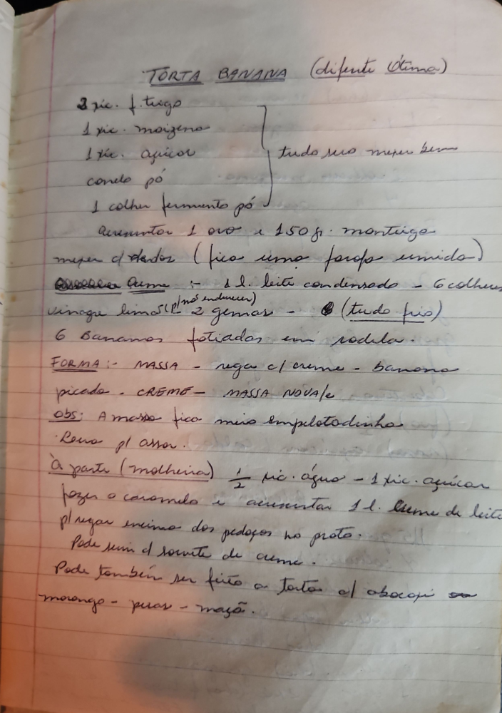

# Página 109
:::danger[NÃO REVISADO]
A página não foi revisada, portanto pode conter erros de digitação, formatação ou alucinações.
:::
## TORTA BANANA (difonte Olina)

### Massa

*   3 xic. f. trigo
*   1 xic. maizena
*   1 xic. açucar
*   canela pó
*   1 colher fermento pó
    *   tudo mio meger bem

Augmentar 1 ovo e 150 gr. manteiga
meper c/ dedos (fica uma farofa umido)

### Creme

Receita Creme:
*   1 d.l. leite condensado - 6 colher vinagre limao (p/ no induren)
*   2 gemas
    *   (tudo frio)

*   6 Bananas fatiadas em rodela.

### Montagem

FORMA: MASSA
rega c/ creme
banana picada
CREME
MASSA NOVA/e

### Observação

OBS: A massa fico meio empletodinho
Leva pl assar.

### Calda (Molheira)

À parte (molheira):
*   ½ xic. água
*   1 xic. açucar

fazer o caramelo e aumentar 1 d.l. creme de leite
pluger encima dos pedaçor no prato.

### Sugestão

Pode servir c/ sorvete de creme.

### Variações

Pode tambem ser feito a Torta de abacaxi ou morango - peras - maçã.

