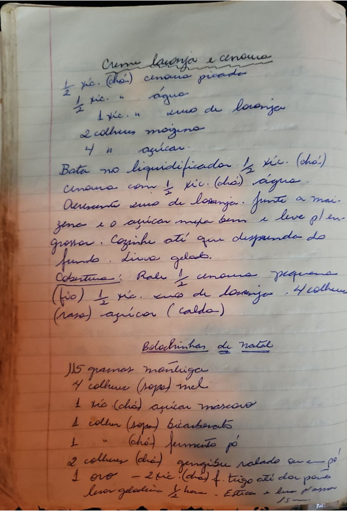

# Página 110
:::danger[NÃO REVISADO]
A página não foi revisada, portanto pode conter erros de digitação, formatação ou alucinações.
:::
## Creme laranja e cenoura

- ½ xíc. (chá) cenoura picada
- ½ xíc. " água
- 1 xíc. " suco de laranja
- 2 colheres maizena
- 4 " açúcar

Bata no liquidificador ½ xíc. (chá) cenoura com ½ xíc. (chá) água.
Acrescente suco de laranja. Junte a maizena e o açúcar mexa bem e leve p/ engrossar. Cozinhe até que desprenda do fundo. Leve gelar.

### Cobertura:

- Rale ½ cenoura pequena (fina)
- ½ xíc. suco de laranja
- 4 colheres (rasas) açúcar (calda)

## Bolochinhas de natal

- 115 gramas manteiga
- 4 colheres (sopa) mel
- 1 xíc. (chá) açúcar mascavo
- 1 colher (sopa) bicarbonato
- 1 " (chá) fermento pó
- 2 colheres (chá) gengibre ralado ou em pó
- 1 ovo
- 2 xíc. (chá) far. trigo até dar ponto

Levar geladeira ½ hora. Esticar e fazer passo 15.

