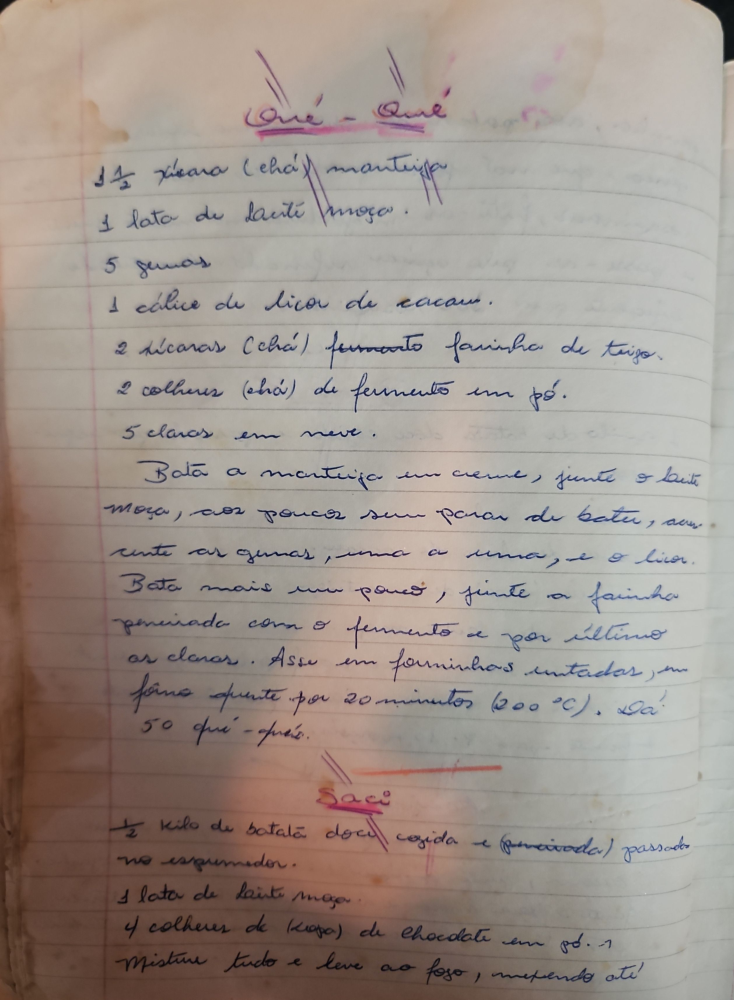

# Página 11
:::danger[NÃO REVISADO]
A página não foi revisada, portanto pode conter erros de digitação, formatação ou alucinações.
:::
## Que-Que

*   1 1/2 xícara (chá) manteiga
*   1 lata de leite moça.
*   5 gemas
*   1 cálice de licor de cacau.
*   2 xícaras (chá) fermento farinha de trigo.
*   2 colheres (chá) de fermento em pó.
*   5 claras em neve.

Bata a manteiga em creme, junte o leite moça, aos poucos sem parar de bater, acr[es]cente as gemas, uma a uma, e o licor. Bata mais um pouco, junte a farinha peneirada com o fermento e por último as claras. Asse em forminhas untadas, em fôrno quente por 20 minutos (200°C). Dá! 50 que-ques.

## Saci

*   1/2 kilo de batata doce cozida e (peneirada) passado no espremedor.
*   1 lata de leite moça.
*   4 colheres de (sopa) de chocolate em pó. (?)

Misture tudo e leve ao fogo, mexendo até!

