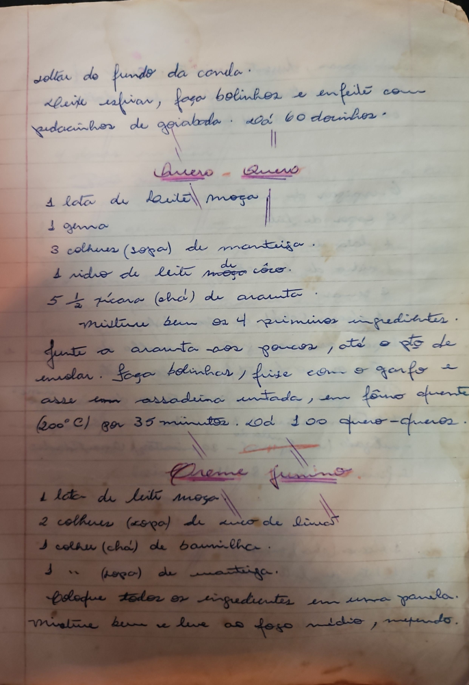

# Página 12
:::danger[NÃO REVISADO]
A página não foi revisada, portanto pode conter erros de digitação, formatação ou alucinações.
:::
soltar do fundo da panela.
Deixe esfriar, faça bolinhos e enfeite com pedacinhos de goiabada. Dá 60 docinhos.

## Quero - Quero

*   1 lata de leite moça
*   1 gema
*   3 colheres (sopa) de manteiga
*   1 vidro de leite de côco
*   5 1/2 xícara (chá) de araruta

1.  Misture bem os 4 primeiros ingredientes.
2.  Junte a araruta aos poucos, até o pto de enrolar.
3.  Faça bolinhas, frise com o garfo e asse em assadeira untada, em forno quente (200°C) por 35 minutos.
4.  Dá 100 quero-queros.

## Creme Junino

*   1 lata de leite moça
*   2 colheres (sopa) de suco de limão
*   1 colher (chá) de baunilha
*   1 colher (sopa) de manteiga

1.  Coloque todos os ingredientes em uma panela.
2.  Misture bem e leve ao fogo médio, mexendo.

