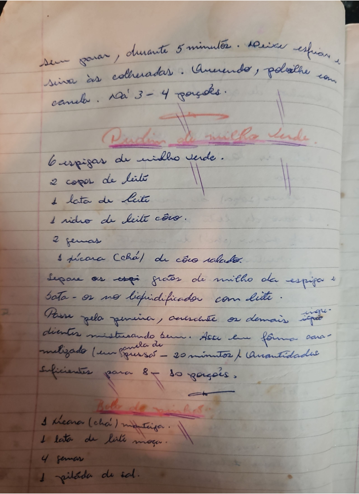

# Página 13
:::danger[NÃO REVISADO]
A página não foi revisada, portanto pode conter erros de digitação, formatação ou alucinações.
:::
Sem parar, durante 5 minutos. Deixe esfriar e sirva às colheradas. Querendo, polvilhe com canela. Dá 3 - 4 porções.

## Pudim de milho Verde

*   6 espigas de milho verde.
*   2 copos de leite
*   1 lata de leite
*   1 vidro de leite côco.
*   2 gemas
*   1 xícara (Chá) de côco ralado.

Separe os grãos de milho da espiga e bata-os no liquidificador com leite.
Passe pela peneira, acrescente os demais ingredientes misturando bem. Asse em fôrma caramelizado (uns 20 minutos). Quantidade suficientes para 8 - 10 porções.

## Bolo de milho

*   1 xícara (chá) manteiga.
*   1 lata de leite moça.
*   4 gemas
*   1 pitada de sal.

