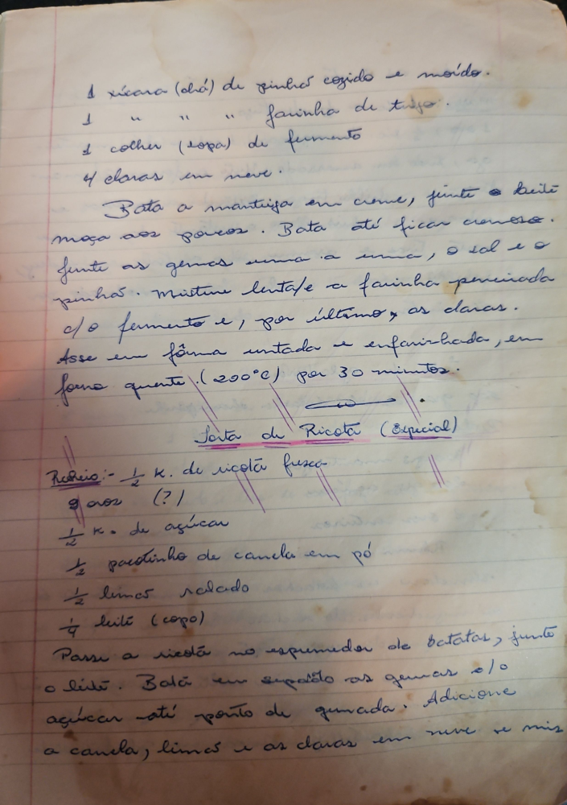

# Página 14
:::danger[NÃO REVISADO]
A página não foi revisada, portanto pode conter erros de digitação, formatação ou alucinações.
:::
```markdown
- 1 xícara (chá) de pinhão cozido e moído
- 1 " " " farinha de trigo.
- 1 colher (sopa) de fermento
- 4 claras em neve.

Bata a manteiga em creme, junte a massa aos poucos. Bata até ficar cremoso.
Junte as gemas uma a uma, o sal e o pinhão. Misture lentam. a farinha peneirada c/o fermento e, por último, as claras.
Asse em fôrma untada e enfarinhada, em forno quente (200°C) per 30 minutos.

### Torta de Ricota (Especial)

Recheio:
- ½ K. de ricota fresca
- 8 gemas (?)
- ½ K. de açúcar
- ½ pacotinho de canela em pó
- ½ limão ralado
- ¼ leite (copo)

Passa a ricota no espremedor de batatas, junte o leite. Bata em separado as gemas c/o açúcar até ponto de quindim. Adicione a canela, limão e as claras em neve e mis.
```

