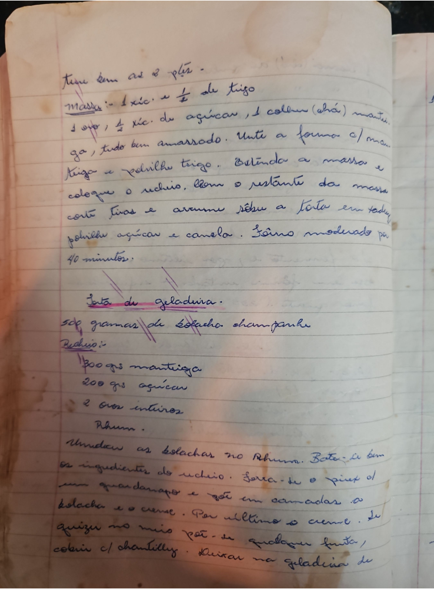

# Página 15
:::danger[NÃO REVISADO]
A página não foi revisada, portanto pode conter erros de digitação, formatação ou alucinações.
:::
Tire bem as 2 pts.

### Massa:
- 1 xic. e 1/2 de trigo
- 1 ôvo, 1/2 xic. de açúcar, 1 colher (chá) manteiga, tudo bem amassado.

Unte a forma c/ manteiga e polvilhe trigo. Estenda a massa e coloque o recheio, com o restante da massa corte tiras e arrume sôbre a torta em toda. polvilhe açúcar e canela. Fôrno moderado por 40 minutos.

## Torta de geladeira
- 500 gramas de Bolacha champagne

### Recheio:
- 300 grs manteiga
- 200 grs açúcar
- 2 ovos inteiros
- Rhum.

Umedecer as bolachas no Rhum. Bater bem os ingredientes do recheio. Fôrra-se o pirex ou um guardanapo e põe em camadas a bolacha e o creme. Por ultimo o creme. Se quizer no meio pôe-se qualquer fruta, cobrir c/ chantilly. Deixar na geladeira de

