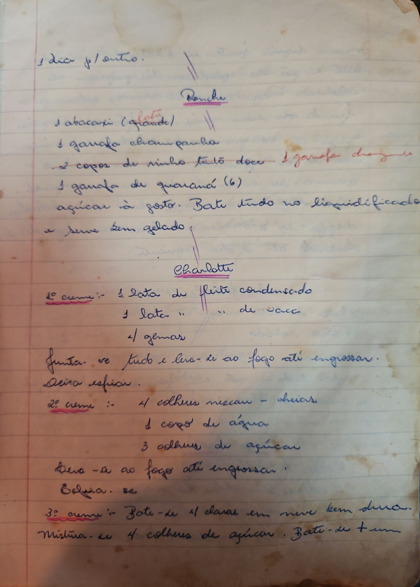

# Página 16
:::danger[NÃO REVISADO]
A página não foi revisada, portanto pode conter erros de digitação, formatação ou alucinações.
:::
1 dia p/ outro.

## Ponche

*   1 abacaxi (grande)
*   1 garrafa champanha
*   2 copos de vinho tinto doce
*   1 garrafa de guaraná (6)
*   açúcar à gosto.
Bati tudo no liquidificador
e serve sem gelado.

## Charlotte

### 1º creme:

*   1 lata de fleite condensado
*   1 lata " " de sace
*   4 gemas
Junta-se tudo e leva-se ao fogo até engrossar.
Deixa esfriar.

### 2º creme:

*   4 colheres niscam - chiãs
*   1 copo de água
*   3 colheres de açúcar
Leva-se ao fogo até engrossar.
Bolha-se.

### 3º creme:

Bate-se 4 claras em neve bem dura.
Mistura-se 4 colheres de açúcar. Bate-se + um

