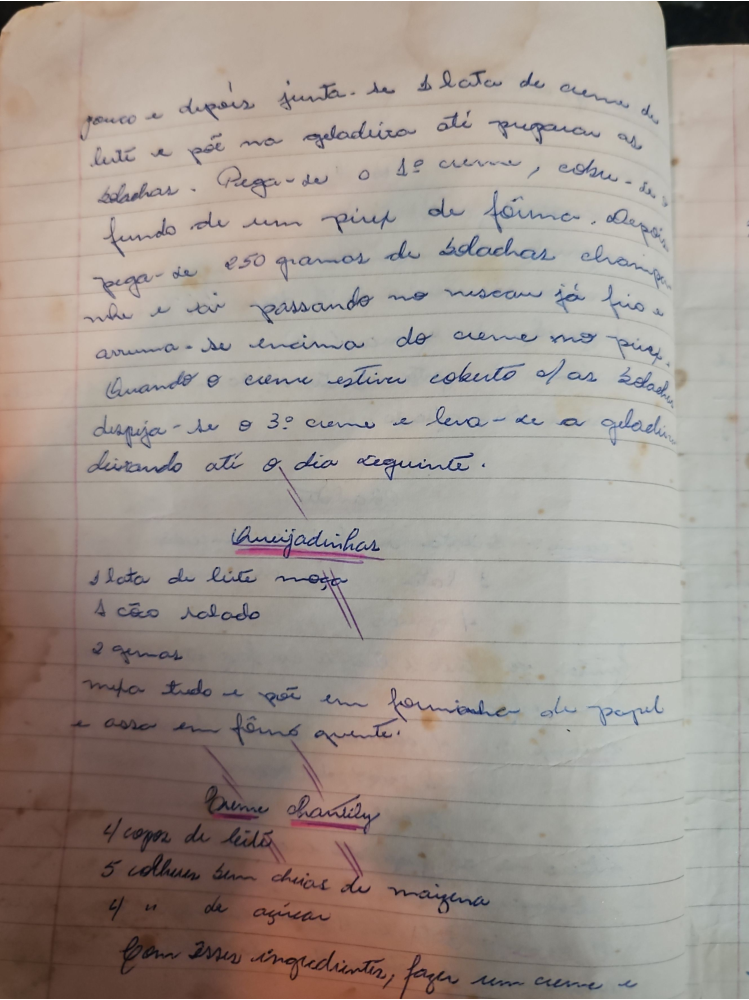

# Página 17
:::danger[NÃO REVISADO]
A página não foi revisada, portanto pode conter erros de digitação, formatação ou alucinações.
:::
pouco e depois junta-se 1 lata de creme de leite e põe na geladeira até pegar as bolachas. Pega-se o 1º creme, cobre-se o fundo de um pirex de fôrma. Depois pega-se 250 gramas de bolachas champanhe e vai passando no nescau já frio e arruma-se encima do creme no pirex. Quando o creme estiver coberto c/ as bolachas dispija-se o 3º creme e leva-se a geladeira deixando até o dia seguinte.

## Queijadinhas

* 1 lata de leite moça
* 1 côco ralado
* 2 gemas

mistura tudo e põe em forminhas de papel e assa em fôrno quente.

## Creme chantilly

* 4 copos de leite
* 5 colheres bem cheias de maizena
* 4 '' de açucar

Com esses ingredientes, fazer um creme e

