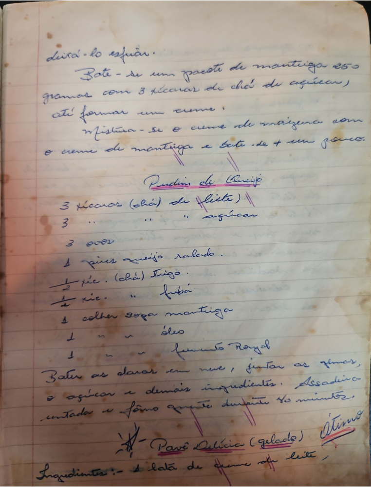

# Página 18
:::danger[NÃO REVISADO]
A página não foi revisada, portanto pode conter erros de digitação, formatação ou alucinações.
:::
deixá-lo esfriar.

Bate-se um pacote de manteiga 250
gramas com 3 xícaras de chá de açúcar)
até formar um creme;
Mistura-se o creme de maizena com
o creme de manteiga e bate-se + um pouco.

## Pudim de Queijo

- 3 xícaras (chá) de leite)
- 3 " " açúcar
- 3 ovos
- 1 pires queijo ralado.
- ½ xíc. (chá) Trigo.
- ½ xíc. " fubá
- 1 colher sopa manteiga
- 1 " " óleo
- 1 " " fermento Royal

Bater as claras em neve, juntar as gemas,
o açúcar e demais ingredientes. Assar em
untada e forno quente durante 40 minutos.

## Pavê Delícia (gelado)
*(ótimo)*

Ingredientes:
- 1 lata de creme de leite,

