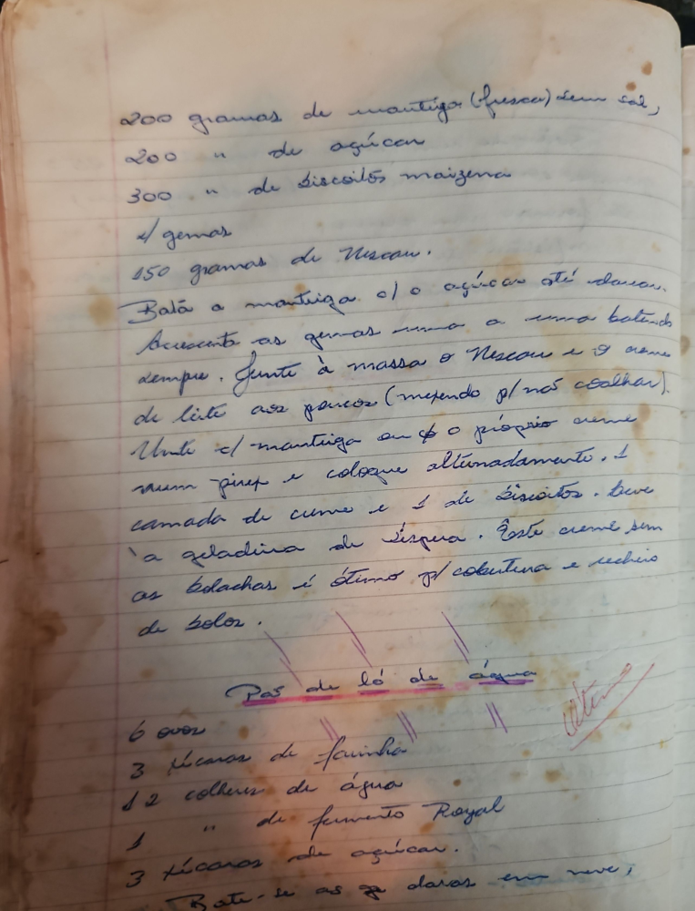

# Página 19
:::danger[NÃO REVISADO]
A página não foi revisada, portanto pode conter erros de digitação, formatação ou alucinações.
:::
## Creme com biscoitos

- 200 gramas de mantiga (fresca) sem sal,
- 200 " de açúcar
- 300 " de biscoitos maizena
- 4 gemas
- 150 gramas de Nescau.

Bata a mantiga c/ o açúcar até embranquecer.
Acrescente as gemas uma a uma batendo sempre.
Junte à massa o Nescau e o creme de leite aos poucos (mexendo para não coalhar).
Unte c/ mantiga ou c/ o próprio creme num pirex e coloque alternadamente, 1 camada de creme e 1 de biscoitos.
Leve à geladeira até esfriar.

Este creme sem as bolachas é ótimo para cobertura e recheio de bolos.

## Pão de ló de água

- 6 ovos
- 3 xícaras de farinha
- 12 colher de água
- 1 " de fermento Royal
- 3 xícaras de açúcar.

Bate-se as claras em neve,

