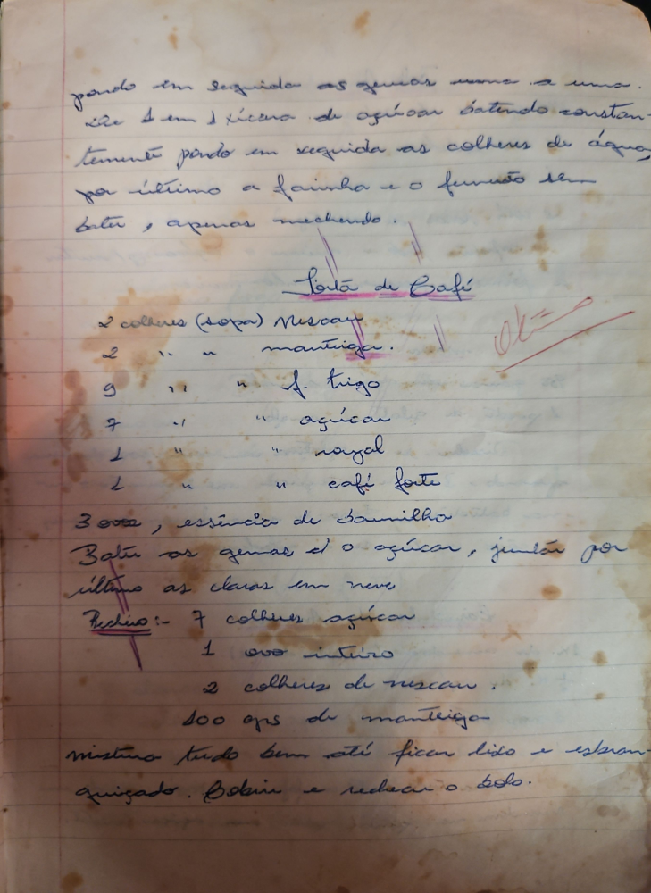

# Página 20
:::danger[NÃO REVISADO]
A página não foi revisada, portanto pode conter erros de digitação, formatação ou alucinações.
:::
## Torta de Café

Ponha em seguida as gemas uma a uma bater bem o açucar batendo constantemente. Ponha em seguida as colheres de agua, por último a farinha e o fermento sem bater, apenas mexendo.

*   2 colheres (sopa) Nescau
*   2 colheres mantiga.
*   9 colheres f. trigo
*   7 colheres açucar
*   1 colher royal
*   1 colher café forte
*   3 ovos, essencia de Baunilha

Bater as gemas e o açucar, juntar por ultimo as claras em neve.

### Recheio

*   7 colheres açucar
*   1 ovo inteiro
*   2 colheres de nescau
*   100 grs de manteiga

Mistura tudo bem até ficar liso e espalhar aquecido. Cobrir e rechear o bolo.

