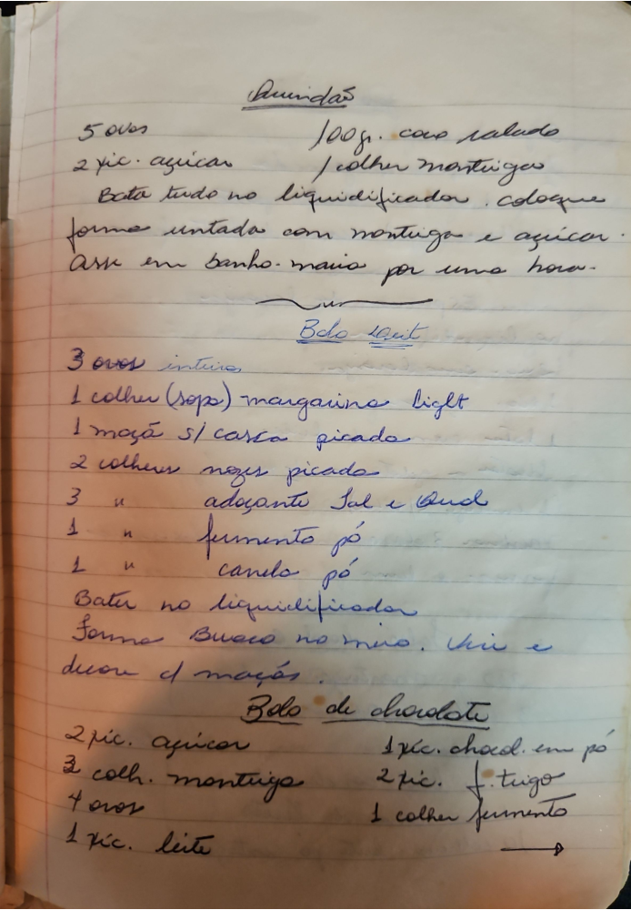

# Página 111
:::danger[NÃO REVISADO]
A página não foi revisada, portanto pode conter erros de digitação, formatação ou alucinações.
:::
## Pudim

- 5 ovos
- 2 xic. açucar
- 100gr coco ralado
- 1 colher manteiga

Bata tudo no liquidificador. coloque forma untada com mantiga e açucar. Assar em banho-maria por uma hora.

## Bolo Light

- 3 ovos inteiros
- 1 colher (sopa) margarina light
- 1 maçã s/ casca picada
- 2 colheres nozes picada
- 3 " adoçante Tal e Qual
- 1 " fermento pó
- 1 " canela pó

Bater no liquidificador.
Forma Buraco no meio. Unir e decorr c/ maçãs.

## Bolo de chocolate

- 2 xic. açucar
- 3 colh. mantiga
- 4 ovos
- 1 xic. leite
- 1 xic. chocol. em pó
- 2 xic. f. trigo
- 1 colher fermento

