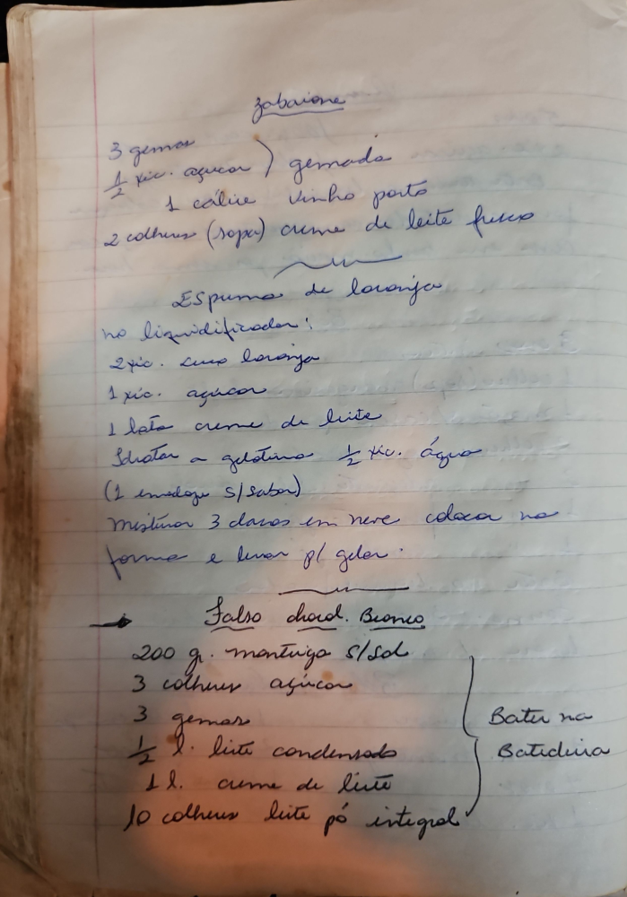

# Página 112
:::danger[NÃO REVISADO]
A página não foi revisada, portanto pode conter erros de digitação, formatação ou alucinações.
:::

## Zabaione

*   3 gemas
*   ½ xic. açúcar ) gemada
*   1 cálice vinho porto
*   2 colheres (sopa) creme de leite fresco

## Espuma de laranja

no liquidificador:

*   2xic. suco laranja
*   1 xic. açúcar
*   1 lata creme de leite
*   hidratar a gelatina ½ xic. água
*   (1 envelope S/sabor)
*   misturar 3 claras em neve
*   coloca na forma e levar p/ gelar.

## Falso chocd. Branco

*   200 gr. mantiga S/Sal
*   3 colheres açúcar
*   3 gemas
*   ½ l. leite condensado
*   1 l. creme de leite
*   10 colheres leite pó integral

} Bater na Batideira

