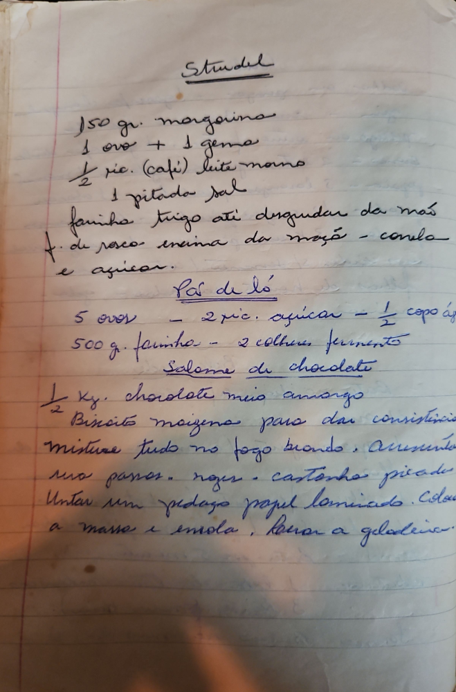

# Página 114
:::danger[NÃO REVISADO]
A página não foi revisada, portanto pode conter erros de digitação, formatação ou alucinações.
:::
## Strudel

- 150 gr. margarina
- 1 ovo + 1 gema
- 1/2 xic. (café) leite morno
- 1 pitada sal
- farinha trigo até desgrudar da mão
- f. de rosca encima da maçã - canela e açucar.

## Pão de Ló

- 5 ovos - 2 xic. açucar - 1/2 copo água
- 500 g. farinha - 2 colheres fermento

## Salame de chocolate

- 1/2 Kg. chocolate meio amargo
- Biscoito maizena para dar consistencia

Mistura tudo no fogo brando. Acrescenta sua passas. nozes. - castanha picada.
Untar um pedaço papel laminado. Colocar a massa e embola. levar a geladeira.

