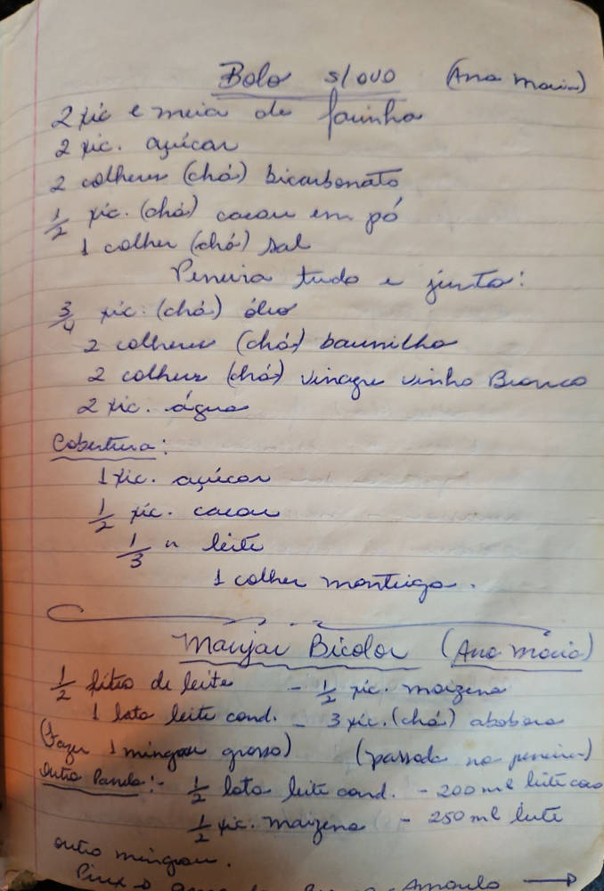

# Página 115
:::danger[NÃO REVISADO]
A página não foi revisada, portanto pode conter erros de digitação, formatação ou alucinações.
:::
## Bolo s/ ovo (Ana Maria)

- 2 xíc. e meia de farinha
- 2 xíc. açúcar
- 2 colheres (chá) bicarbonato
- ½ xíc. (chá) cacau em pó
- 1 colher (chá) sal

Penura tudo e junto:

- ¾ xíc. (chá) óleo
- 2 colheres (chá) baunilha
- 2 colher (chá) vinagre vinho Branco
- 2 xíc. água

### Cobertura:

- 1 xíc. açúcar
- ½ xíc. cacau
- ⅓ xíc. leite
- 1 colher manteiga.

## Manjar Bicolor (Ana Maria)

- ½ litro de leite
- ½ xíc. maizena
- 1 lata leite cond.
- 3 xíc. (chá) abobora (fazer um mingau grosso) (passada no peneira)

Outra panela:

- ½ lata leite cond. - 200 ml leite coco
- ½ xíc. maizena - 250 ml leite

outro mingau.

