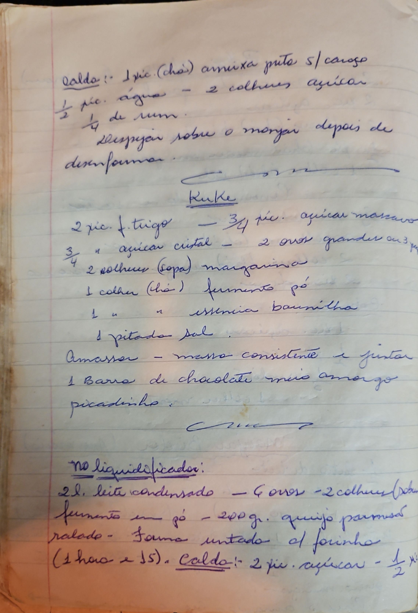

# Página 116
:::danger[NÃO REVISADO]
A página não foi revisada, portanto pode conter erros de digitação, formatação ou alucinações.
:::
## Calda

- 1 xíc. (chá) ameixa preta s/ caroço
- ½ xíc. água - 2 colheres açúcar
- ¼ de rum
- Despejar sobre o manjar depois de desenformar.

## Kuke

- 2 xic. f. trigo - ¾ xíc. açúcar mascavo
- ¾ " açúcar cristal - 2 ovos grandes ou 3 pequenos
- 2 colheres (sopa) margarina
- 1 colher (chá) fermento pó
- 1 " " essencia baunilha
- 1 pitada sal
- Amassar - massa consistente e juntar
- 1 Barra de chocolate meio amargo
  picadinho.

## no liquidificador

- 2l. leite condensado - 4 ovos - 2 colheres (sopa)
- fermento em pó - 200 gr. queijo parmesão
  ralado - Forma untada el farinha
- (1 hora e 15). Calda: 2 xíc. açúcar - ½ xíc.

