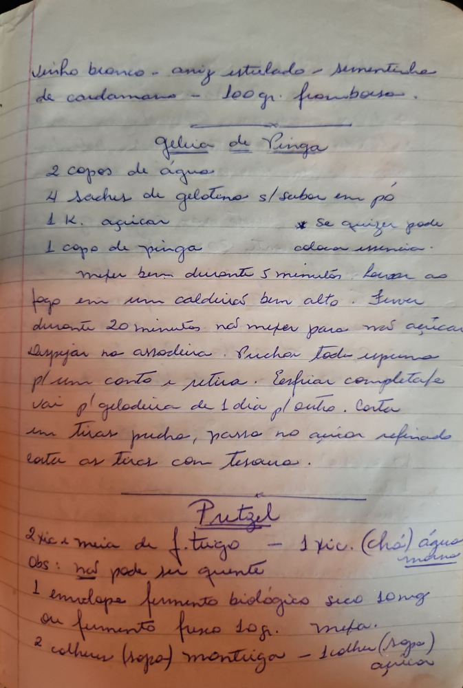

# Página 117
:::danger[NÃO REVISADO]
A página não foi revisada, portanto pode conter erros de digitação, formatação ou alucinações.
:::
## Vinho branco - aniz estrelado - sementinha de cardamomo - 100 gr. framboesa.

## Geléia de Pinga

- 2 copos de água
- 4 saches de gelatina s/sabor em pó
- 1 K. açúcar
- 1 copo de pinga
    - * Se quiser pode colocar essencia.
- mefer bem durante 5 minutos. levar ao fogo em um caldeirão bem alto. Fever durante 20 minutos não mefer para não açucarar.
- despejar na assadeira. Puxar toda espuma pl um canto e retira. Esfriar completamente.
- Vai p'geladeira de 1 dia pl outro. Corta em Tirar pedra, passa no açucar refinado.
- cortar as tiras com Tesoura.

## Pretzel

- 2 Xic. e meia de f. trigo - 1 Xic. (Chá) água morna
    - Obs: não pode ser quente
- 1 envelope fermento biologico seco 10mg
    - ou fermento fresco 30g. met.
- 2 colher (sopa) mantiga - 1 colher (Sopa) açucar

