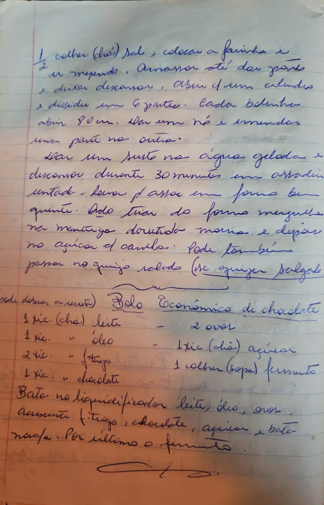

# Página 118
:::danger[NÃO REVISADO]
A página não foi revisada, portanto pode conter erros de digitação, formatação ou alucinações.
:::
1/2 colher (chá) sal, colocar a farinha e
ir mexendo. Amassar até dar ponto
e deixar descansar. Abrir 4 um cilindro
e dividir em 6 partes. Cada bolinho
abrir 80 cm. Dar um nó e emendar
uma parte na outra.
Dar um susto na água gelada e
descansar durante 30 minutos em assadeir
untada. Levar p/ assar em forno bem
quente. Qdo tirar do forno mergulha
na manteiga derretida morna e depois
no açúcar c/ canela. Pode também
passar no queijo ralado (se quiser salgado

(Desde desde a massa)
## Bolo Econômico de Chocolate
- 1 xíc. (chá) leite
- 1 xíc. " óleo
- 2 xíc. " trigo
- 1 xíc. " chocolate
- 2 ovos
- 1 xíc. (chá) açúcar
- 1 colher (sopa) fermento

Bata no liquidificador leite, óleo, ovos.
Acrescente trigo, chocolate, açúcar e bata
novamente. Por último o fermento.

