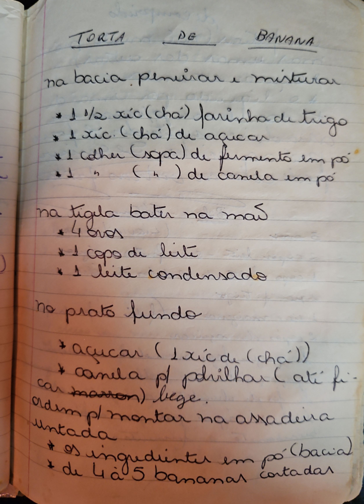

# Página 119
:::danger[NÃO REVISADO]
A página não foi revisada, portanto pode conter erros de digitação, formatação ou alucinações.
:::
## TORTA DE BANANA

na bacia peneirar e misturar

*   1 ¹/² xíc (chá) farinha de trigo
*   1 xíc. (chá) de açúcar
*   1 colher (sopa) de fermento em pó
*   1 " (" ") de canela em pó

na tigela bater na mão

*   4 ovos
*   1 copo de leite
*   1 leite condensado

no prato fundo

*   açúcar (1 xíc de (chá))
*   canela p/ polvilhar (até fi-car marron) bege.

ordem p/ montar na assadeira untada

*   os ingredientes em pó (bacia)
*   de 4 à 5 bananas cortadas

