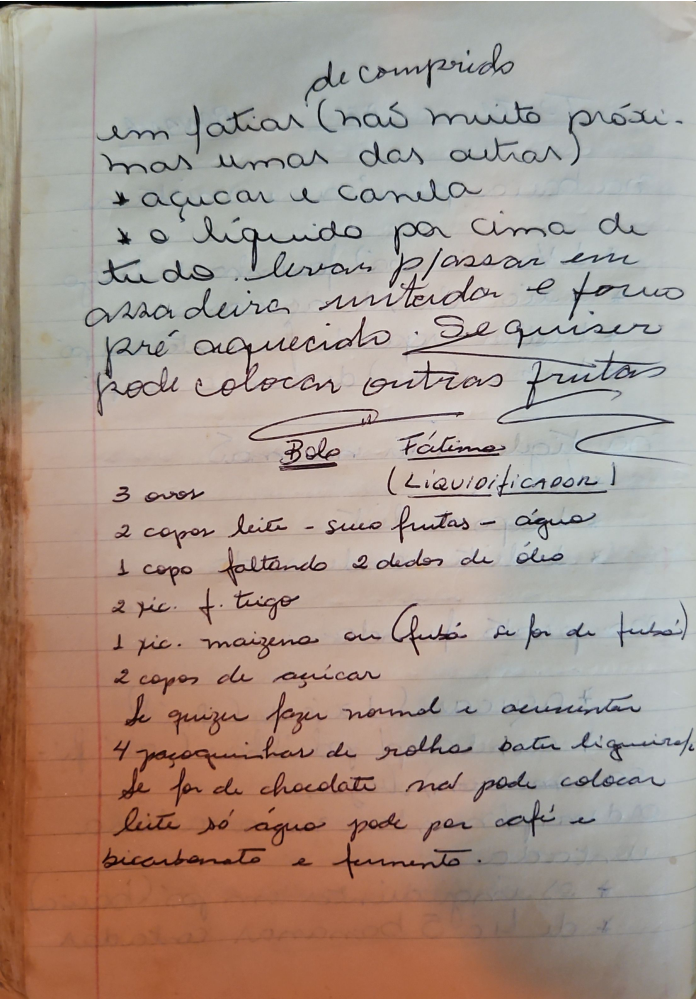

# Página 120
:::danger[NÃO REVISADO]
A página não foi revisada, portanto pode conter erros de digitação, formatação ou alucinações.
:::
de comprido
em fatias (não muito próxi-
mas umas das outras)
* açúcar e canela
* o líquido por cima de
tudo. Levar p/assar em
assadeiras untada e forno
pré aquecido. Se quiser
pode colocar outras frutas

## Bolo Fátima
(Liquidificador!)

- 3 ovos
- 2 copos leite - suco frutas - água
- 1 copo faltando 2 dedos de óleo
- 2 xic. f. trigo
- 1 xic. maizena ou fubá (se for de fubá)
- 2 copos de açúcar

Se quizer fazer normal e aumentar
4 paçoquinhas de rolha bater liquidifi-
Se for de chocolate não pode colocar
leite só água pode por café e
bicarbonato e fermento.

