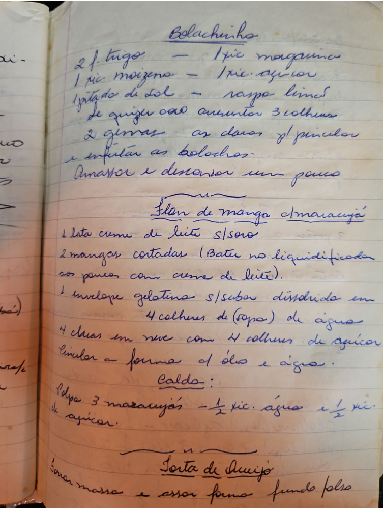

# Página 121
:::danger[NÃO REVISADO]
A página não foi revisada, portanto pode conter erros de digitação, formatação ou alucinações.
:::
## Bolachinhas

* 2 xic. trigo
* 1 xic. maizena
* 1 pitada de sal
* 1/2 xic. margarina
* 1 xic. açúcar
* raspa limão
* Se quiser cão aumentos 3 colheres
* 2 gemas - as claras p/ pincelar e enfeitar as bolachas.
* Amassar e descansar um pouco.

## Flan de manga c/ maracujá

* 1 lata creme de leite s/ soro
* 2 mangas cortadas (Bater no liquidificador aos poucos com creme de leite).
* 1 envelope gelatina s/ sabor dissolvida em 4 colheres de (sopa) de água
* 4 claras em neve com 4 colheres de açúcar
* Pincelar a forma c/ óleo e água.

### Caldo:

* Polpa 3 maracujás - 1/2 xic. água e 1/2 xic. de açúcar.

## Torta de Queijo

* Forrar massa e assar forma fundo falso

