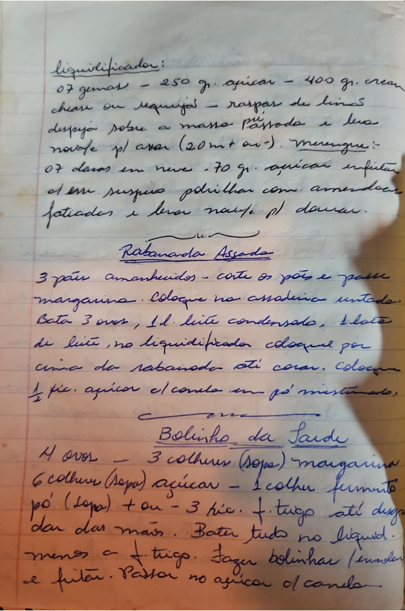

# Página 122
:::danger[NÃO REVISADO]
A página não foi revisada, portanto pode conter erros de digitação, formatação ou alucinações.
:::
## Receita Liquidificador

- 07 gemas
- 250 gr. açúcar
- 400 gr. cream cheese ou requeijão
- raspas de limão

Despeja sobre a massa pré assada e leva na fôrma p/ assar (20 mt ou -).

### Merengue:
- 07 claras em neve
- 70 gr. açúcar

Enfeitar c/ esse suspiro, polvilhar com amendoas fatiadas e levar na fôrma p/ dourar.

## Rabanada Assada

- 3 pães amanhecidos - corte os pães e passe margarina. Coloque na assadeira untada.
- Bata 3 ovos, 1 l. leite condensado, 1 lata de leite, no liquidificador.
- Coloque por cima da rabanada até corar.
- Coloque ½ xíc. açúcar c/ canela em pó misturado.

## Bolinho da Tarde

- 4 ovos
- 3 colheres (sopa) margarina
- 6 colheres (sopa) açúcar
- 1 colher fermento pó (sopa)
- \+ ou - 3 xíc. f. trigo até desgrudar das mãos.

Bater tudo no liquid. menos a f. trigo. Fazer bolinhas (enrolar) e fritar. Passar no açúcar c/ canela.

