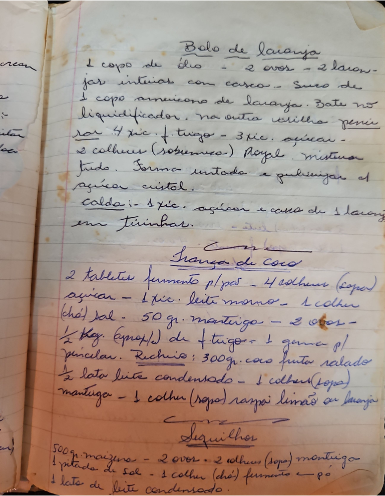

# Página 123
:::danger[NÃO REVISADO]
A página não foi revisada, portanto pode conter erros de digitação, formatação ou alucinações.
:::
## Bolo de Laranja

*   1 copo de óleo
*   2 ovos
*   2 laranjas inteiras com casca
*   Suco de 1 copo americano de laranja. Bate no liquidificador.
*   Na outra vasilha peneirar 4 xic. f. trigo
*   3 xic. açucar
*   2 colheres (sobremesa) Royal
*   misturar tudo. Forma untada e pulverizar c/ açucar cristal.

### Calda

*   1 xic. açucar e casca de 1 laranja em tirinhas.

## Trança de Coco

*   2 tabletas fermento p/ pão
*   4 colheres (sopa) açucar
*   1 xic. leite morno
*   1 colher (chá) sal
*   50 gr. manteiga
*   2 ovos
*   ½ Kg (aproxim) de f. trigo
*   1 gema p/ pincelar.

### Recheio

*   300gr. coco fresco ralado
*   ½ lata leite condensado
*   1 colher (sopa) manteiga
*   1 colher (sopa) raspas limão ou laranja

## Sequilhos

*   500 gr. maizena
*   2 ovos
*   2 colheres (sopa) manteiga
*   1 pitada de sal
*   1 colher (chá) fermento em pó
*   1 lata de leite condensado.

