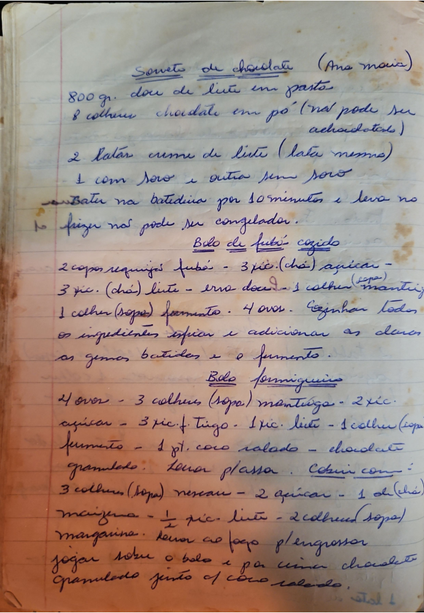

# Página 124
:::danger[NÃO REVISADO]
A página não foi revisada, portanto pode conter erros de digitação, formatação ou alucinações.
:::
## Sorvete de chocolate (Ana Maria)

- 800 gr. doce de leite em pasta
- 8 colher chocolate em pó (não pode ser achocolatado)
- 2 latas creme de leite (lata mesmo)
  - 1 com soro e outra sem soro

Bater na batedeira por 10 minutos e levar no freezer.
Não pode ser congelador.

## Bolo de fubá cozido

- 2 copos requeijão fubá
- 3 xíc. (chá) açucar
- 3 xíc. (chá) leite
- erva doce
- 1 colher (sopa) mantiga
- 1 colher (sopa) fermento
- 4 ovos.

Cozinhar todos os ingredientes esfriar e adicionar as claras batidas e o fermento.

## Bolo formigueiro

- 4 ovos
- 3 colheres (sopa) mantiga
- 2 xíc. açucar
- 3 xíc. f. Trigo
- 1 xíc. leite
- 1 colher (sopa) fermento
- 1 pt. coco ralado
- chocolate granulado

Levar p/assa.
Cobrir com:
- 3 colheres (sopa) nescau
- 2 açucar
- 1 dl (chá) maizena
- ½ xíc. leite
- 2 colheres (sopa) margarina.

Levar ao fogo p/engrossar jogar sobre o bolo e por cima chocolate granulado junto c/ coco ralado.

