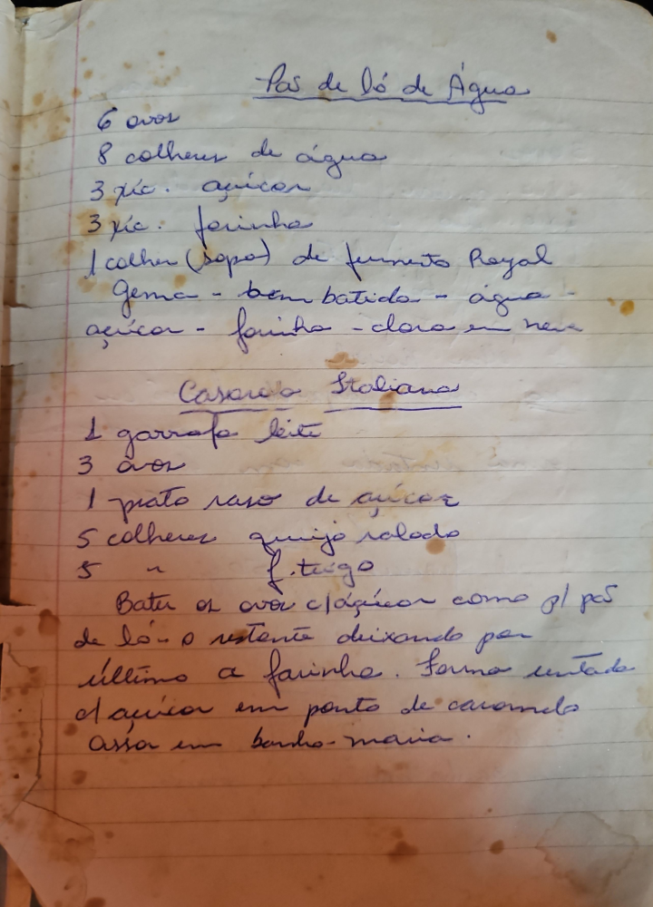

# Página 125
:::danger[NÃO REVISADO]
A página não foi revisada, portanto pode conter erros de digitação, formatação ou alucinações.
:::
## Pão de Ló de Água

*   6 ovos
*   8 colheres de água
*   3 xíc. açúcar
*   3 xíc. farinha
*   1 colher (sopa) de fermento Royal

*   Gema - bem batida - água
*   Açúcar - farinha - clara em neve

## Casarolo Italiano

*   1 garrafa leite
*   3 ovos
*   1 prato raso de açúcar
*   5 colheres queijo ralado
*   5 " " f. trigo

*   Bater os ovos c/ açúcar como p/ pão de ló.
*   o restante deixando p/ último a farinha.
*   Forma untada c/ açúcar em ponto de caramelo
*   Assar em banho-maria.

