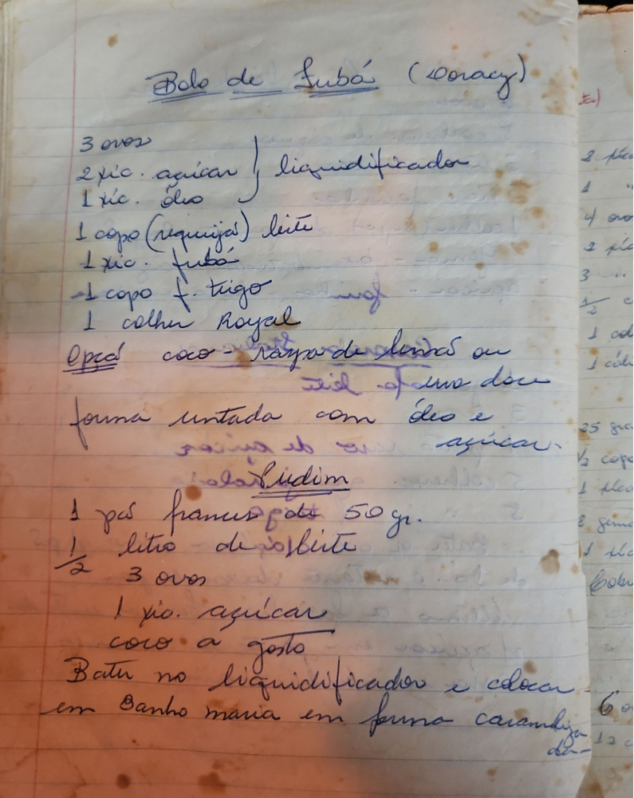

# Página 126
:::danger[NÃO REVISADO]
A página não foi revisada, portanto pode conter erros de digitação, formatação ou alucinações.
:::
## Bolo de Fubá (Doracy)

*   3 ovos
*   2 xic. açúcar
*   1 xic. óleo
*   1 copo (requeijão) leite
*   1 xic. fubá
*   1 copo f. trigo
*   1 colher Royal
*   Opção coco - raspa de limão ou zidel de uns doce

forma untada com óleo e açúcar.

## bolo Pudim

*   1 pão frances peda 50 gr.
*   1/2 litro de leite
*   3 ovos
*   1 xic. açúcar
*   coco a gosto

Bater no liquidificador e colocar em Banho maria em forma caramela.

