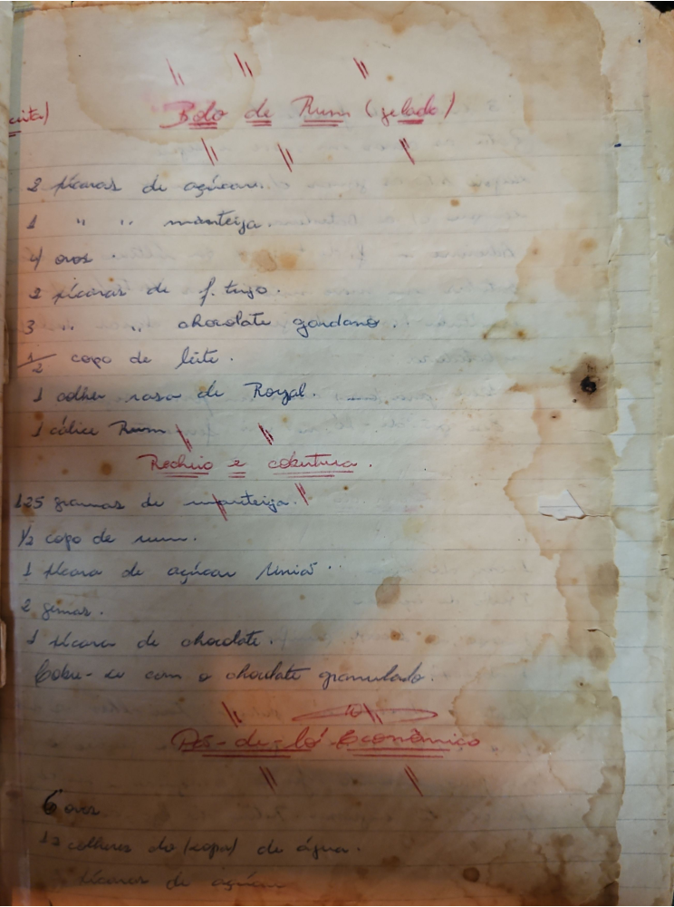

# Página 127
:::danger[NÃO REVISADO]
A página não foi revisada, portanto pode conter erros de digitação, formatação ou alucinações.
:::
## Bolo de Russa (gelado)

- 2 xícaras de açúcar.
- 1 xícara de manteiga.
- 4 ovos.
- 2 xícaras de f. trigo.
- 3 xícaras de chocolate gardano.
- ½ copo de leite.
- 1 colher rasa de Royal.
- 1 cálice Rumm.

### Recheio e Cobertura

- 125 gramas de manteiga.
- ½ copo de rum.
- 1 xícara de açúcar união.
- 2 gemas.
- 1 xícara de chocolate.
- cobrir com o chocolate granulado.

### Pão-de-ló Econômico

- 6 ovos.
- 12 colheres de sop de água.
- 1 xícara de açúcar...

