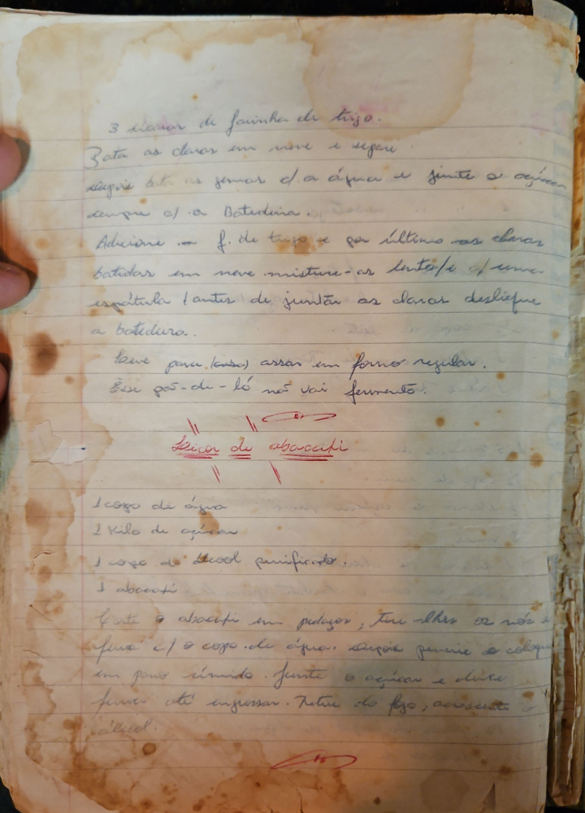

# Página 128
:::danger[NÃO REVISADO]
A página não foi revisada, portanto pode conter erros de digitação, formatação ou alucinações.
:::
3 xícaras de farinha de trigo.

Bate as claras em neve e separa.
Depois bate as gemas c/ a açúcar e junte a sempre c/ a Batedeira.
Adicione a f. de trigo e por último as claras batidas em neve misture-as inté se iformar espatula (antes de juntar as claras desligue a batedeira.
leve para (casa) assar em forno regular.
Esse pos-de-ló não vai fermento.

## Licor de abacati

* 1 copo de água
* 1 Kilo de açúcar
* 1 copo de Álcool purificado.
* 1 abacati

Corte o abacati em pedaços; Tire os olhos e não a fibra c/ o copo de água. Depois peneire e coloque em pano sumindo. Junte o açúcar e deixe ferver até engrossar. Retire do fogo; acrescente o álcool.

