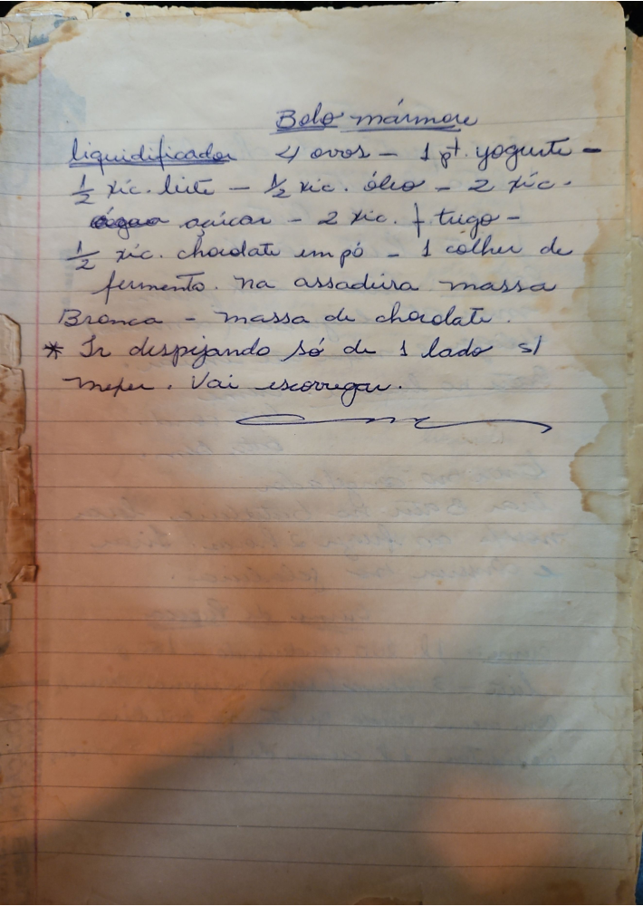

# Página 129
:::danger[NÃO REVISADO]
A página não foi revisada, portanto pode conter erros de digitação, formatação ou alucinações.
:::
## Bolo mármore

**Liquidificador:**
- 4 ovos
- 1 pote yogurte
- 1/2 xíc. leite
- 1/2 xíc. óleo
- 2 xíc. açúcar
- 2 xíc. farinha de trigo
- 1/2 xíc. chocolate em pó
- 1 colher de fermento

**Na assadeira:**
- massa Branca
- massa de chocolate.

***
* Ir despejando só de 1 lado sem mexer. Vai escorregar.

