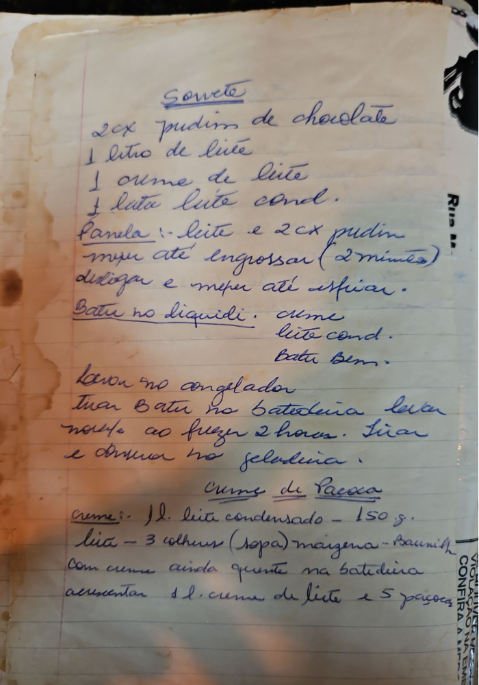

# Página 130
:::danger[NÃO REVISADO]
A página não foi revisada, portanto pode conter erros de digitação, formatação ou alucinações.
:::
## Sorvete

*   2 cx pudim de chocolate
*   1 litro de leite
*   1 creme de leite
*   1 lata leite cond.

### Panela:

*   leite e 2 cx pudim mexer até engrossar (2 minutos)
*   desligar e mexer até esfriar.

### Batir no liquidor:

*   creme
*   leite cond.
*   Bater bem.

*   Levar no congelador
*   Tirar Batir na batedeira. levar
*   nove ao fazer 2 horas. tirar
*   e Arrumar no geladeira.

## Creme de Paçoca

### Creme:

*   1 l. leite condensado - 150 g.
*   leite - 3 colheres (sopa) maizena - Baunilha
*   Com creme ainda quente na batedeira
*   acrescentar 1 l. creme de leite e 5 paçoca

