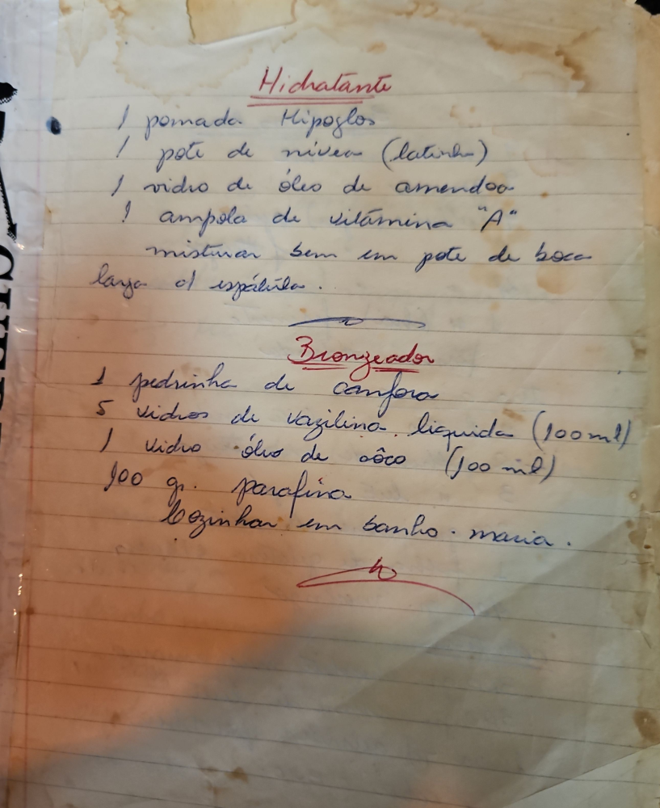

# Página 131
:::danger[NÃO REVISADO]
A página não foi revisada, portanto pode conter erros de digitação, formatação ou alucinações.
:::
## Hidratante

*   1 pomada Hipoglos
*   1 pote de nivea (latinha)
*   1 vidro de óleo de amendoa
*   1 ampola de vitamina "A"

misturar bem em pote de boca larga com espátula.

## Bronzeador

*   1 pedrinha de canfora
*   5 vidros de vazilina liquida (100ml)
*   1 vidro óleo de côco (100 ml)
*   100 gr. parafina

Cozinhar em banho maria.

