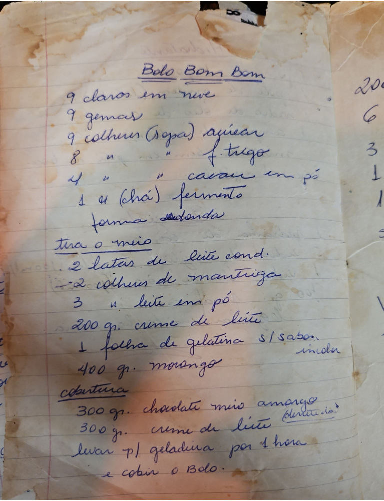

# Página 132
:::danger[NÃO REVISADO]
A página não foi revisada, portanto pode conter erros de digitação, formatação ou alucinações.
:::
## Bolo Bom Bom

- 9 claras em neve
- 9 gemas
- 9 colheres (Sopa) açucar
- 8 " " f. trigo
- 4 " " cacau em pó
- 1 " (chá) fermento

forma redonda
tira o meio

- 2 latas de leite cond.
- 2 colheres de manteiga
- 3 " leite em pó
- 200 gr. creme de leite
- 1 folha de gelatina s/ sabor incolor
- 400 gr. morango

### Cobertura

- 300 gr. chocolate meio amargo
- 300 gr. creme de leite (fervido)

Levar p/ geladeira por 1 hora
e cobrir o bolo.

